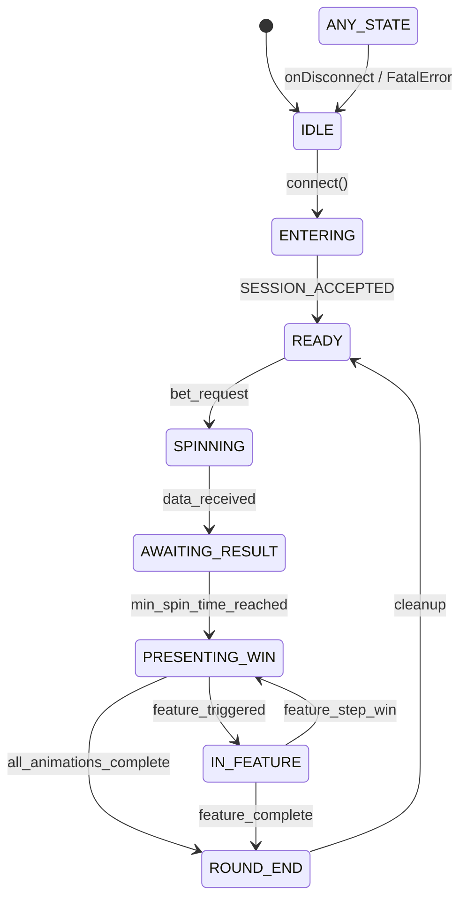

# Slot Round Lifecycle

The `RoundStateMachine` governs the high-level progression of a slot round, ensuring compliance with both server protocol and operator (Pariplay) requirements.

## Lifecycle Diagram

## Key State Transitions & Rules

### 1. `ticketReceived`
Triggered exactly when the **last** server response containing mathematical results for the current round (bet/result) arrives. This is dispatched to the operator iFrame via `postMessage`.

### 2. `roundEnded`
Triggered only upon entering `ROUND_END`. This state is reached after all visual animations (win celebrations, symbol destructions, etc.) have finalized.

### 3. Min Spin Time
The transition from `SPINNING` -> `PRESENTING_WIN` is gated by the **Min Spin Time** compliance rule. If server data arrives in 100ms, the state machine should stay in `AWAITING_RESULT` until the required 1.5s - 3s (config driven) has elapsed.

### 4. Turbo Play
In `Turbo` mode, transition timings are shortened and skip-logic is enabled, but the state sequence remains identical to ensure logic consistency.
