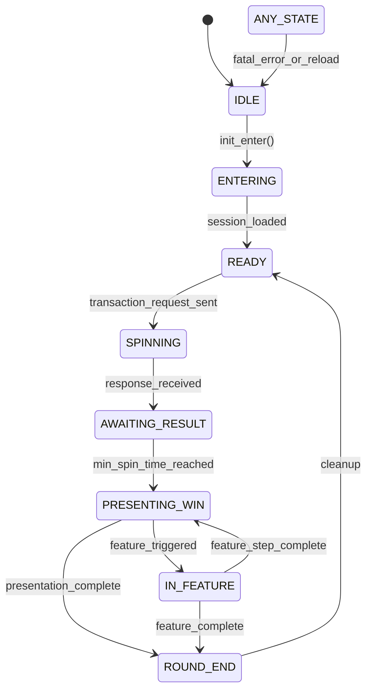

# Slot Round Lifecycle

The `RoundStateMachine` governs round progression for client presentation while GS remains authoritative for financial/session truth.

## Lifecycle Diagram

## Key Rules

1. GS response is authoritative for result, wallet, and recoverable state.
2. Client applies min-spin-time gating before final win presentation.
3. Turbo/skip changes only presentation timing, never financial outcome.
4. Round end occurs after visual completion; not at response arrival.
