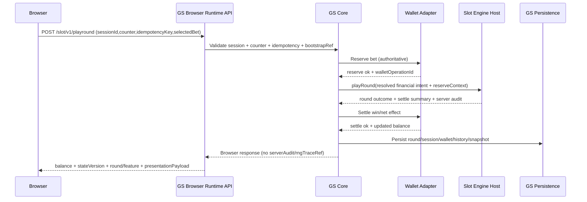
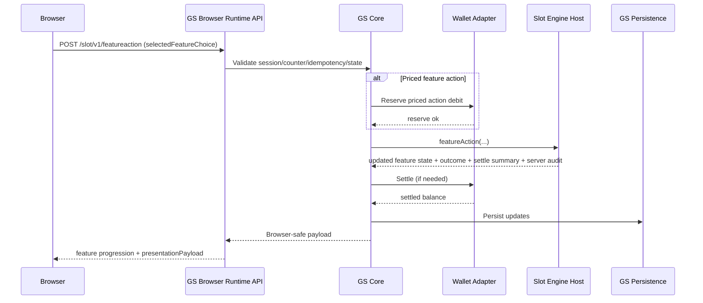
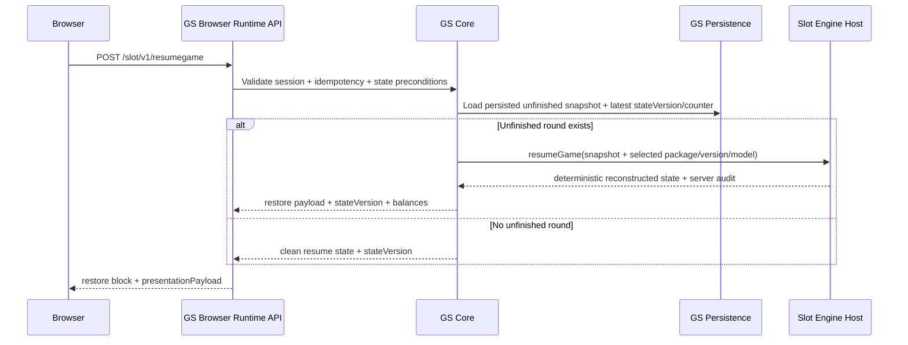
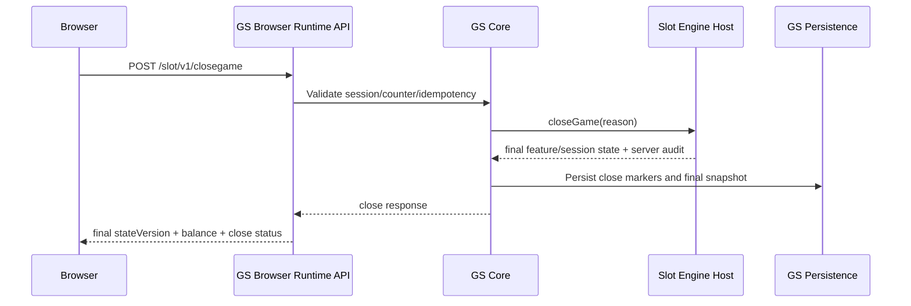

# GS Browser Runtime Sequence Diagrams (New Slots)

- Status: Draft for implementation (Phase 1)
- Date: 2026-02-28
- Contract version: `slot-browser-v1`
- Related:
  - `docs/gs/browser-runtime-api-contract.md`
  - `docs/gs/internal-slot-runtime-contract.md`

## 1) Launch + Bootstrap + OpenGame

```mermaid
sequenceDiagram
    participant Browser
    participant Launch as GS Launch Route
    participant API as GS Browser Runtime API
    participant Core as GS Core

    Browser->>Launch: GET /cwstartgamev2.do?bankId&subCasinoId&gameId&mode&token&lang
    Launch->>Core: Validate launch/auth/context
    Core-->>Launch: SID + route + bootstrap refs
    Launch-->>Browser: 302 redirect to client shell with SID and runtime refs

    Browser->>API: POST /slot/v1/bootstrap (sessionId + bootstrapRef; no requestCounter/idempotencyKey)
    API->>Core: Resolve config/policies/versions (read-only)
    Core-->>API: Bootstrap payload
    API-->>Browser: bootstrap(configId, policies, math/client versions; state unchanged)

    Browser->>API: POST /slot/v1/opengame
    API->>Core: Validate session/counter/idempotency/state
    Core->>Core: Load persisted unfinished state marker
    Core-->>API: Open response payload
    API-->>Browser: stateVersion, balance, presentationPayload, restore block
```

## 2) PlayRound (Reserve -> Engine -> Settle)



## 3) FeatureAction (Priced and Non-Priced)



## 4) ResumeGame (Reconnect / Unfinished Round)



## 5) GetHistory (Browser-Pulled from GS)

```mermaid
sequenceDiagram
    participant Browser
    participant API as GS Browser Runtime API
    participant Core as GS Core
    participant DB as GS Persistence

    Browser->>API: POST /slot/v1/gethistory (sessionId + requestCounter; no idempotencyKey)
    API->>Core: Validate session + correlation counter (read-only)
    Core->>DB: Query history rows by session/player scope
    DB-->>Core: History records
    Core-->>API: Normalized history payload
    API-->>Browser: history list/page cursor
```

## 6) CloseGame


