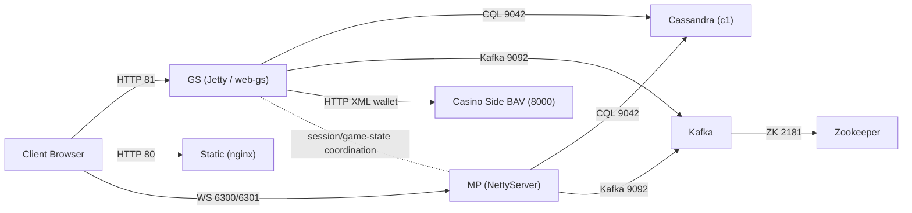

# 01 Architecture

## Goal
Record proven runtime links, and separate what is still a hypothesis.

## Topology (First Proven Map)

## Proven Links
- `Client -> GS` (HTTP):
  - GS is exposed on `81:8080` in compose.
  - Support endpoints are mapped in Struts (`/support/bankSupport`, `/support/bankSelectAction`).
  - Evidence:
    - `/Users/alexb/Documents/Dev/Doker/gs-docker/configs/docker-compose.yml`
    - `/Users/alexb/Documents/Dev/mq-gs-clean-version/game-server/web-gs/src/main/webapp/WEB-INF/struts-config.xml`
- `Client -> Static` (HTTP):
  - Static container exposes `80:80`.
  - Evidence:
    - `/Users/alexb/Documents/Dev/Doker/gs-docker/configs/docker-compose.yml`
- `GS -> Cassandra`:
  - GS container waits for Cassandra (`c1:9042`) before startup.
  - GS logs show `CassandraBankInfoPersister` load and schema activity.
  - Evidence:
    - `/Users/alexb/Documents/Dev/Doker/gs-docker/configs/gs/wait-for-cassandra-and-start.sh`
    - GS logs (`docker logs gp3-gs-1`) captured on 2026-02-10.
- `MP -> Cassandra`:
  - MP startup command rewrites Cassandra hosts to `c1:9042`.
  - Evidence:
    - `/Users/alexb/Documents/Dev/Doker/gs-docker/configs/docker-compose.yml`
- `GS -> Kafka` and `MP -> Kafka`:
  - Kafka service exists and MP is started with `-Dkafka.hosts=kafka:9092`.
  - GS startup waits for Kafka availability.
  - Evidence:
    - `/Users/alexb/Documents/Dev/Doker/gs-docker/configs/docker-compose.yml`
    - `/Users/alexb/Documents/Dev/Doker/gs-docker/configs/gs/wait-for-cassandra-and-start.sh`
- `Kafka -> Zookeeper`:
  - Kafka has `KAFKA_ZOOKEEPER_CONNECT=zookeeper:2181`.
  - Evidence:
    - `/Users/alexb/Documents/Dev/Doker/gs-docker/configs/docker-compose.yml`
- `GS -> Casino-side wallet (BAV)`:
  - GS calls configured URLs like `/bav/authenticate`, `/bav/balance`, `/bav/betResult`, `/bav/refundBet` on port `8000`.
  - Evidence:
    - runtime GS logs with `RESTCWClient ... request, response from url:http://host.docker.internal:8000/bav/...`
    - bank config values in Cassandra `bankinfocf.jcn`.
- `Client -> MP websocket`:
  - Lobby/game websocket endpoints are `/websocket/mplobby` and `/websocket/mpgame`.
  - MP listeners confirmed on `6300/6301` after restart.
  - Evidence:
    - `/Users/alexb/Documents/Dev/mq-mp-clean-version/web/src/main/java/com/betsoft/casino/mp/config/WebSocketRouter.java`
    - MP runtime listener check via `/proc/net/tcp*`.

## Confidence Markers
- `PROVEN`: container wiring, ports, startup dependencies, and bank support endpoints.
- `PROVEN`: GS cache loading from Cassandra (`CassandraBankInfoPersister loadAll` in logs).
- `PROVEN`: MP launch class and runtime dependencies (`com.betsoft.casino.mp.web.NettyServer`).
- `TO VERIFY`: complete post-launch gameplay path for all critical flows (bet/settle/reconnect) with GS+MP+wallet timestamp correlation.
