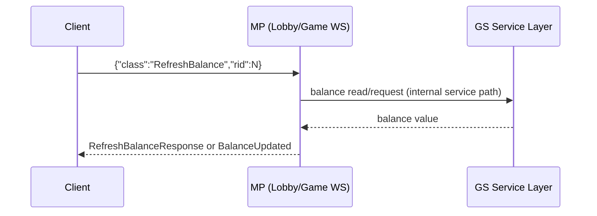

# Balance Refresh Flow

## Plain-English Summary
Balance can update in two ways:
- server pushes a `BalanceUpdated` event
- client asks for refresh with `RefreshBalance`

This keeps wallet/balance values aligned while player is in lobby or in a game room.

## Trigger
- Player requests refresh.
- A server event changes balance (for example after game action).

## Technical Trace (Current Ground Truth)
1. Lobby channel refresh request mapping:
   - `RefreshBalance` -> `LobbyRefreshBalanceHandler`
   - File: `/Users/alexb/Documents/Dev/mq-mp-clean-version/web/src/main/java/com/betsoft/casino/mp/web/socket/LobbyWebSocketHandler.java`
2. Game channel refresh request mapping:
   - `RefreshBalance` -> `RefreshBalanceHandler`
   - File: `/Users/alexb/Documents/Dev/mq-mp-clean-version/web/src/main/java/com/betsoft/casino/mp/web/socket/GameWebSocketHandler.java`
3. GS side balance push helper:
   - `MQServiceHandler.sendBalanceUpdated(...)` creates `BalanceUpdated` and sends it.
   - File: `/Users/alexb/Documents/Dev/mq-gs-clean-version/game-server/common-gs/src/main/java/com/dgphoenix/casino/gs/socket/mq/MQServiceHandler.java`
4. In-service Kafka route exists for balance-updated requests.
   - File: `/Users/alexb/Documents/Dev/mq-gs-clean-version/game-server/common-gs/src/main/java/com/dgphoenix/casino/kafka/handler/inservice/SendBalanceUpdatedRequestHandler.java`

## Logs To Watch
- `RefreshBalance, account=..., got balance=...`
  - File: `/Users/alexb/Documents/Dev/mq-gs-clean-version/game-server/web-gs/src/main/java/com/dgphoenix/casino/actions/api/RefreshBalanceAction.java`
- MP/WebSocket errors:
  - `error|exception|caused by` in `gp3-mp-1` logs

## Settings That Change Behavior
- Bank mode (`real/free/bonus`) affects effective available balance mode.
- Cash bonus / tournament sessions change what balance value is exposed in response.
- Source references:
  - `/Users/alexb/Documents/Dev/readme all you need to know from md files/MaxQuest_ProtocolV2.txt`
  - `/Users/alexb/Documents/Dev/readme all you need to know from md files/CrashGame_Protocol.txt`

## Verification Checklist
1. In lobby WS, send `RefreshBalance`.
2. Confirm response arrives and/or `BalanceUpdated` event appears.
3. Check GS/MP logs for exceptions.

## Diagram

