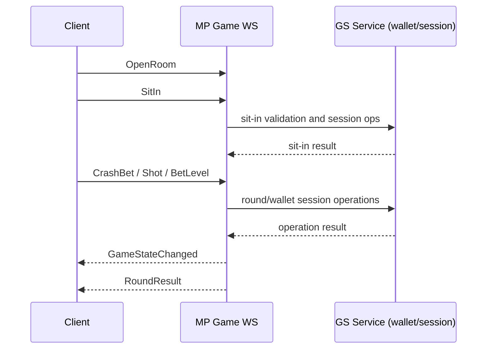

# Bet / Spin / Settle Flow

## Plain-English Summary
Once player is in a room (`OpenRoom` + `SitIn`), gameplay commands are sent on game websocket.
For Crash, bet commands are `CrashBet` and `CrashCancelBet`.
For MaxQuest-style shooter rounds, actions include `Shot` and `BetLevel`.
Round completion is broadcast with `RoundResult` and follow-up room-state events.

## Trigger
- Player performs game action after `SitIn`.

## Technical Trace (Current Ground Truth)
1. Room entry on game socket:
   - `OpenRoom` -> `OpenRoomHandler`
   - `SitIn` -> `SitInHandler`
   - File: `/Users/alexb/Documents/Dev/mq-mp-clean-version/web/src/main/java/com/betsoft/casino/mp/web/socket/GameWebSocketHandler.java`
2. Gameplay commands:
   - `Shot` -> `ShotHandler`
   - `BetLevel` -> `BetLevelHandler`
   - `CrashBet` -> `CrashBetHandler`
   - `CrashCancelBet` -> `CrashCancelBetHandler`
   - `CrashCancelAllBets` -> `CrashCancelAllBetsHandler`
   - File: `/Users/alexb/Documents/Dev/mq-mp-clean-version/web/src/main/java/com/betsoft/casino/mp/web/socket/GameWebSocketHandler.java`
3. Result/settle events:
   - `RoundResult`
   - `GameStateChanged`
   - `CloseRoundResults`
   - Protocol source:
     - `/Users/alexb/Documents/Dev/readme all you need to know from md files/MaxQuest_ProtocolV2.txt`
     - `/Users/alexb/Documents/Dev/readme all you need to know from md files/CrashGame_Protocol.txt`
4. GS service-side wallet/session operations are exposed in:
   - `MQServiceHandler.sitIn(...)`
   - `MQServiceHandler.sitOut(...)`
   - `MQServiceHandler.addWinWithSitOut(...)`
   - File: `/Users/alexb/Documents/Dev/mq-gs-clean-version/game-server/common-gs/src/main/java/com/dgphoenix/casino/gs/socket/mq/MQServiceHandler.java`

## Logs To Watch
- MP: game command exceptions and handler errors (`error|exception|caused by`)
- GS: session/balance warnings during sit-in/sit-out processing

## Settings That Change Behavior
- Bank/game settings that influence gameplay payload:
  - `MQ_WEAPONS_MODE`
  - `MQ_WEAPONS_SAVING_ALLOWED`
  - `CW_SEND_REAL_BET_WIN`
  - `DISABLE_MQ_BACKGROUND_LOADING`
- Source:
  - `/Users/alexb/Documents/Dev/mq-gs-clean-version/game-server/web-gs/src/main/webapp/free/mp/template.jsp`

## Verification Checklist
1. `OpenRoom` then `SitIn`.
2. Send one action command (`CrashBet` or `Shot`).
3. Verify `GameStateChanged` and `RoundResult`.
4. Verify no repeated exceptions in GS/MP logs.

## Diagram

