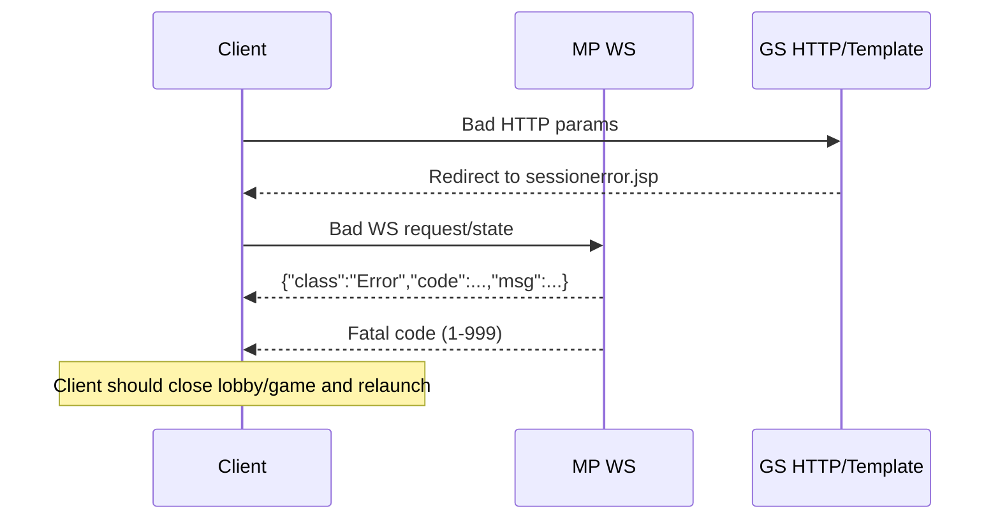

# Error Handling Flow

## Plain-English Summary
Errors are handled at two levels:
- protocol-level JSON errors (`class: Error`, numeric `code`)
- HTTP/template/support-page errors in GS (for bad request shape or missing params)

This flow explains what is expected noise vs real blockers.

## Trigger
- invalid request payload
- missing or invalid session
- wrong launch query params
- room/game state mismatch

## Technical Trace (Current Ground Truth)
1. Protocol error object shape and ranges:
   - `{"code":..., "msg":"...", "class":"Error", "rid":...}`
   - ranges:
     - `1-999` fatal
     - `1000-4999` error
     - `5000-9999` warning
   - Sources:
     - `/Users/alexb/Documents/Dev/readme all you need to know from md files/MaxQuest_ProtocolV2.txt`
     - `/Users/alexb/Documents/Dev/readme all you need to know from md files/CrashGame_Protocol.txt`
2. GS support page bad request example:
   - `/support/bankSelectAction.do` without `bankId` can throw `NumberFormatException`.
   - parse line:
     - `Long.parseLong(bankPropForm.getBankId() != null ? bankPropForm.getBankId() : request.getParameter("bankId"));`
   - File: `/Users/alexb/Documents/Dev/mq-gs-clean-version/game-server/web-gs/src/main/java/com/dgphoenix/casino/support/cache/bank/edit/actions/editproperties/BankSelectAction.java`
3. GS template bad launch params:
   - missing `BANKID/SID/gameId` logs an explicit error and redirects to `sessionerror.jsp`.
   - File: `/Users/alexb/Documents/Dev/mq-gs-clean-version/game-server/web-gs/src/main/webapp/free/mp/template.jsp`

## Known Expected Errors (Do Not Treat As Platform Failure)
- Calling `/support/bankSelectAction.do` without `bankId`.
- Launching template with wrong lowercase keys (`bankId/sessionId/lang` instead of `BANKID/SID/LANG`).

## Blocking Errors (Treat As Failure)
- GS never reaches `Initialization was successfully completed` and `ALL INITIALIZED`.
- repeated exception loops in GS/MP logs after startup.
- container restart loops in `docker ps`.

## Quick Triage Commands
- GS tail:
  - `docker logs --tail 500 gp3-gs-1`
- GS filtered:
  - `/bin/zsh -lc "docker logs --tail 500 gp3-gs-1 2>&1 | rg -i 'error|exception|caused by|fail|invalid|started|initializ|keyspace|mq|maxquest|mp'"`
- MP filtered:
  - `/bin/zsh -lc "docker logs --tail 500 gp3-mp-1 2>&1 | rg -i 'error|exception|caused by|critical|unable|serverid|started|startreactorserver|startjettyserver|bind|listening'"`

## Diagram

