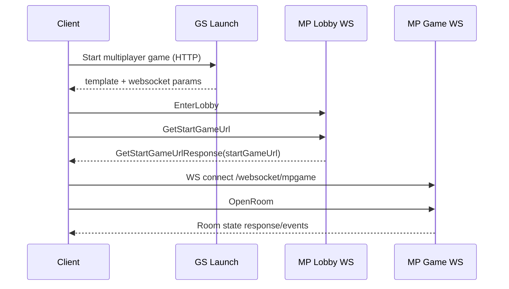

# Game Start Flow

## Plain-English Summary
After lobby login, client asks MP for a start-game URL.
Client then opens game socket and sends `OpenRoom`.
That moves player from lobby into an active game room context.

## Trigger
- Player presses "start/join room" in lobby UI.

## Technical Trace (Current Ground Truth)
1. Client sends `GetStartGameUrl` on lobby socket.
   - Mapped in `LobbyWebSocketHandler`:
   - File: `/Users/alexb/Documents/Dev/mq-mp-clean-version/web/src/main/java/com/betsoft/casino/mp/web/socket/LobbyWebSocketHandler.java`
2. MP returns `GetStartGameUrlResponse` with start URL.
   - Protocol source:
     - `/Users/alexb/Documents/Dev/readme all you need to know from md files/MaxQuest_ProtocolV2.txt`
     - `/Users/alexb/Documents/Dev/readme all you need to know from md files/CrashGame_Protocol.txt`
3. Client opens game websocket endpoint (`/websocket/mpgame`).
   - Endpoint mapping:
   - File: `/Users/alexb/Documents/Dev/mq-mp-clean-version/web/src/main/java/com/betsoft/casino/mp/config/WebSocketRouter.java`
4. Client sends `OpenRoom`.
   - Mapped in `GameWebSocketHandler`:
   - File: `/Users/alexb/Documents/Dev/mq-mp-clean-version/web/src/main/java/com/betsoft/casino/mp/web/socket/GameWebSocketHandler.java`
5. Typical next requests are `SitIn`, then gameplay requests.

## GS-Side Start URL Feed
GS provides multiplayer websocket base to template:
- `WEB_SOCKET_URL = .../websocket/mplobby`
- File: `/Users/alexb/Documents/Dev/mq-gs-clean-version/game-server/web-gs/src/main/java/com/dgphoenix/casino/actions/enter/game/BaseStartGameAction.java`

Template validates launch args:
- `BANKID`, `SID`, `gameId`, `LANG`
- File: `/Users/alexb/Documents/Dev/mq-gs-clean-version/game-server/web-gs/src/main/webapp/free/mp/template.jsp`

## Settings That Change Behavior
- `START_GAME_DOMAIN`
- `USE_SAME_DOMAIN_FOR_START_GAME`
- `ALLOWED_DOMAINS`
- `ALLOWED_ORIGIN`

Settings map:
- `/Users/alexb/Documents/Dev/docs/04-bank-and-game-settings.md`

## Current Risk Note
- Even when start URL and websocket are healthy, game flow can still fail later if wallet identity mapping is inconsistent (`USERID` vs token externalId).
- Validate both transport and wallet-operation identity together in each end-to-end smoke run.

## Verification Checklist
1. Run launch URL with valid uppercase params for bank `6274`:
   - `/free/mp/template.jsp?BANKID=6274&SID=bav_game_session_001&gameId=838&LANG=en`
2. Run launch URL with valid uppercase params for bank `6275`:
   - `/free/mp/template.jsp?BANKID=6275&SID=bav_game_session_002&gameId=838&LANG=en`
3. Confirm both return `HTTP 200` and page title `Max Quest: Dragonstone`.
4. Run negative test with lowercase params:
   - `/free/mp/template.jsp?bankId=6275&sessionId=bav_game_session_002&gameId=838&lang=en`
5. Confirm negative test returns `302` to `/error_pages/sessionerror.jsp`.
6. Confirm lobby socket connection.
7. Confirm `GetStartGameUrlResponse`.
8. Confirm game socket open and `OpenRoom` accepted.

## Diagram

