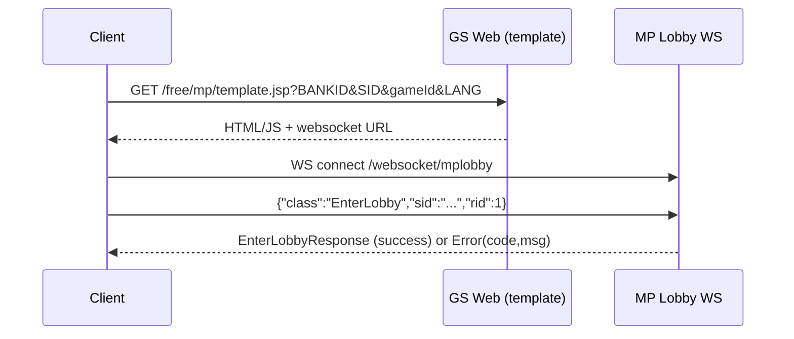

# Login And Lobby Entry Flow

## Plain-English Summary
This is the first multiplayer handshake.
The game start page gives the browser a WebSocket URL and session data.
Then the browser sends `EnterLobby`. If session data is valid, lobby data returns. If not, server returns an error.

## Trigger
- Player starts a multiplayer game from GS launch URL.

## Technical Trace (Current Ground Truth)
1. GS builds multiplayer redirect and appends required params:
   - `BANKID`, `SID`, `gameId`, `LANG`, `WEBSOCKET`
   - File: `/Users/alexb/Documents/Dev/mq-gs-clean-version/game-server/web-gs/src/main/java/com/dgphoenix/casino/actions/enter/game/BaseStartGameAction.java` (`getMultiPlayerForward(...)`)
2. GS template validates required query params.
   - On missing values, redirects to `/error_pages/sessionerror.jsp`.
   - File: `/Users/alexb/Documents/Dev/mq-gs-clean-version/game-server/web-gs/src/main/webapp/free/mp/template.jsp`
3. Browser opens lobby socket to `/websocket/mplobby`.
   - File: `/Users/alexb/Documents/Dev/mq-mp-clean-version/web/src/main/java/com/betsoft/casino/mp/config/WebSocketRouter.java`
4. MP receives `EnterLobby` and routes it to handler.
   - Registration in: `/Users/alexb/Documents/Dev/mq-mp-clean-version/web/src/main/java/com/betsoft/casino/mp/web/socket/LobbyWebSocketHandler.java`
   - Handler class: `com.betsoft.casino.mp.web.handlers.lobby.EnterLobbyHandler`
5. MP sends `EnterLobbyResponse` on success or `Error` with code/msg on failure.
   - Protocol source: `/Users/alexb/Documents/Dev/readme all you need to know from md files/MaxQuest_ProtocolV2.txt`
   - Protocol source: `/Users/alexb/Documents/Dev/readme all you need to know from md files/CrashGame_Protocol.txt`

## Logs To Watch
- `MQ TEMPLATE.JSP:: bankId not found`
- `MQ TEMPLATE.JSP:: SID not found`
- `MQ TEMPLATE.JSP:: gameId not found`
- `Lobby createConnection: sessionId=...`

File evidence:
- `/Users/alexb/Documents/Dev/mq-gs-clean-version/game-server/web-gs/src/main/webapp/free/mp/template.jsp`
- `/Users/alexb/Documents/Dev/mq-mp-clean-version/web/src/main/java/com/betsoft/casino/mp/web/socket/LobbyWebSocketHandler.java`

## Settings That Change Behavior
- Bank domain/origin rules:
  - `allowedRefererDomains`
  - `forbiddenRefererDomains`
  - `ALLOWED_ORIGIN`
  - `ALLOWED_DOMAINS`
- Traceability map:
  - `/Users/alexb/Documents/Dev/docs/04-bank-and-game-settings.md`

## Identity Mapping Caveat (Current Environment)
- Wallet auth response currently contains numeric `USERID` (example: `8`).
- GS lookup/operations in this environment are still tied to token-style `externalId` (`bav_game_session_001`) for the same test account.
- Consequence:
  - support/wallet tools can appear inconsistent unless the same id namespace is used.

## Verification Checklist
1. Open a valid launch URL:
   - `/free/mp/template.jsp?BANKID=6274&SID=bav_game_session_001&gameId=838&LANG=en`
2. Check browser/client receives lobby data (`EnterLobbyResponse`).
3. Force invalid param (remove `SID`) and verify redirect to `sessionerror.jsp`.

## Diagram

