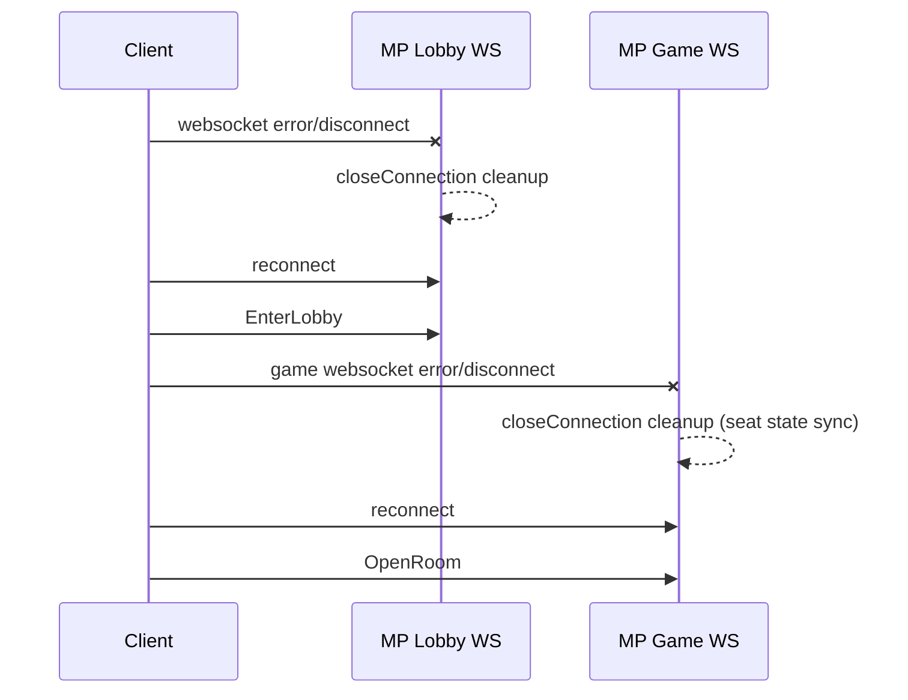

# Reconnect And Recovery Flow

## Plain-English Summary
If connection drops, client should reconnect and re-enter lobby/room.
Protocol docs explicitly require reconnect + resend of key requests.
Server-side socket close handlers clean up stale state and mark seats for safe recovery.

## Trigger
- WebSocket disconnect/error on lobby or game channel.

## Technical Trace (Current Ground Truth)
1. Protocol requirement (lobby):
   - On websocket error, reconnect and resend `EnterLobby`.
   - Source:
     - `/Users/alexb/Documents/Dev/readme all you need to know from md files/MaxQuest_ProtocolV2.txt`
     - `/Users/alexb/Documents/Dev/readme all you need to know from md files/CrashGame_Protocol.txt`
2. Protocol requirement (game):
   - Re-establish game connection and resend room-open flow.
   - Source:
     - `/Users/alexb/Documents/Dev/readme all you need to know from md files/MaxQuest_ProtocolV2.txt`
3. MP lobby close behavior:
   - `LobbyWebSocketHandler.closeConnection(...)` removes socket/session context.
   - File: `/Users/alexb/Documents/Dev/mq-mp-clean-version/web/src/main/java/com/betsoft/casino/mp/web/socket/LobbyWebSocketHandler.java`
4. MP game close behavior:
   - `GameWebSocketHandler.closeConnection(...)` marks seat `wantSitOut`, clears bullets, syncs lobby state.
   - File: `/Users/alexb/Documents/Dev/mq-mp-clean-version/web/src/main/java/com/betsoft/casino/mp/web/socket/GameWebSocketHandler.java`

## Logs To Watch
- `closeConnection: ...` in lobby/game handlers
- repeated reconnect loops with same session id
- `INVALID_SESSION` errors after reconnect attempts

## Settings That Change Behavior
- Session timeout/lobby session compatibility logic in `EnterLobbyHandler`.
- Pending operation checks (`CheckPendingOperationStatus`) can block immediate action replay.
- Handler registration evidence:
  - `/Users/alexb/Documents/Dev/mq-mp-clean-version/web/src/main/java/com/betsoft/casino/mp/web/socket/LobbyWebSocketHandler.java`
  - `/Users/alexb/Documents/Dev/mq-mp-clean-version/web/src/main/java/com/betsoft/casino/mp/web/socket/GameWebSocketHandler.java`

## Verification Checklist
1. Establish lobby and room connections.
2. Force close browser tab/socket.
3. Reconnect and resend `EnterLobby`.
4. Reopen room (`OpenRoom`) and confirm state continuity.

## Diagram

