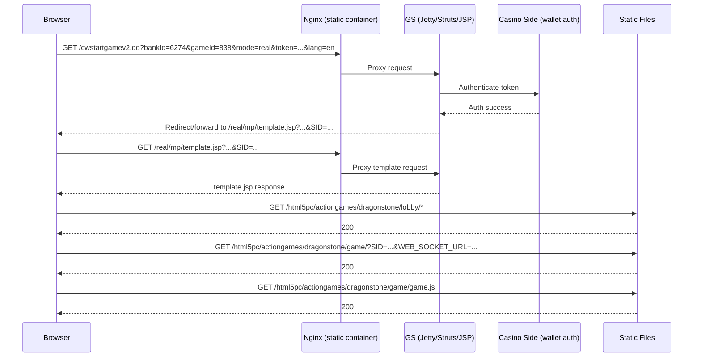

# Game Launch Forensics (CWStartGameV2 -> Template -> Lobby -> Game)

## Scope
This document records the verified launch chain for:
- `http://localhost/cwstartgamev2.do?bankId=6274&gameId=838&mode=real&token=bav_game_session_001&lang=en`

It maps each step to runtime files/configs and current blockers.

## Plain-English Summary
What is working now:
1. GS accepts the launch request.
2. GS reaches `template.jsp` and provides launch/session parameters.
3. Lobby assets load.
4. Game handoff URL now loads (`/html5pc/actiongames/dragonstone/game/?...`) and starts fetching game assets.

What was fixed in this session:
- The previous 404 at game handoff (`/.../dragonstone/game/?...`) was caused by nginx static rule handling directory URLs incorrectly.
- Fixed by changing static nginx `try_files` to include directory/index resolution.

Current focus:
- Keep identity mapping consistent between wallet `<USERID>` and GS `externalId`.
- Validate complete round lifecycle (no stuck `STARTED` wallet operations).

## Proven Runtime Sequence

## Evidence Snapshot
- Template navigation captured in Chrome MCP:
  - `http://localhost/real/mp/template.jsp?...&SID=1_dbd42819ede648603e690000019cbe63_...`
- Game handoff request now successful:
  - `GET /html5pc/actiongames/dragonstone/game/?...` -> `200`
- Game payload now successful:
  - `GET /html5pc/actiongames/dragonstone/game/version.json` -> `200`
  - `GET /html5pc/actiongames/dragonstone/game/validator.js` -> `200`
  - `GET /html5pc/actiongames/dragonstone/game/game.js` -> `200`
- Page snapshot shows game iframe root:
  - title `MAX DUEL`
- Websocket recovery evidence:
  - Previous `ERR_CONNECTION_RESET` on `ws://localhost:6300/websocket/mplobby` was resolved after MP runtime recovery (`gp3-mp-1` restart with listeners active on `6300/6301`).
- Wallet API contract recovery evidence:
  - casino-side `/bav/balance`, `/bav/betResult`, `/bav/refundBet` return `200` for token-style `userId` after endpoint patch + container rebuild.

## File/Config Traceability

### 1) GS route entry
- Struts mapping:
  - `/Users/alexb/Documents/Dev/mq-gs-clean-version/game-server/web-gs/src/main/webapp/WEB-INF/struts-config.xml`
  - route `/cwstartgamev2` -> `CWStartGameAction`

### 2) Launch action handling
- GS action:
  - `/Users/alexb/Documents/Dev/mq-gs-clean-version/game-server/web-gs/src/main/java/com/dgphoenix/casino/actions/enter/game/cwv3/CWStartGameAction.java`

### 3) Start-game forwarding and params
- Base launch logic:
  - `/Users/alexb/Documents/Dev/mq-gs-clean-version/game-server/web-gs/src/main/java/com/dgphoenix/casino/actions/enter/game/BaseStartGameAction.java`

### 4) Launch filter to template
- Filter:
  - `/Users/alexb/Documents/Dev/mq-gs-clean-version/game-server/common-gs/src/main/java/com/dgphoenix/casino/filters/StartGameServletFilter.java`

### 5) Template bootstrap
- Runtime template:
  - `/Users/alexb/Documents/Dev/Doker/runtime-gs/webapps/gs/ROOT/real/html5pc/template.jsp`

### 6) Static routing (critical fix point)
- Static nginx site config (active compose stack):
  - `/Users/alexb/Documents/Dev/mq-gs-clean-version/deploy/docker/configs/static/games`
- Fix applied:
  - from `try_files $uri =404;`
  - to `try_files $uri $uri/ $uri/index.html =404;`

### 7) Static runtime files
- Served from container path:
  - `/www/html/gss/html5pc/actiongames/dragonstone/game/`
- Host-mounted from:
  - `/Users/alexb/Documents/Dev/Doker/runtime-gs/webapps/gs/ROOT/html5pc/actiongames/dragonstone/game/`

## Fixed Failure (Documented)

### Failure
- `GET /html5pc/actiongames/dragonstone/game/?...` returned `404` (nginx page).

### Root cause
- Nginx static regex location used `try_files $uri =404;`, which failed for directory-style URL with query (`/game/?...`) despite directory existing.

### Fix
- Updated nginx `try_files` to handle directory/index fallback.
- Rebuilt static service with:
  - `docker compose -p gp3 -f /Users/alexb/Documents/Dev/mq-gs-clean-version/deploy/docker/configs/docker-compose.yml up -d --build static`

### Result
- Handoff endpoint now returns `200` and game assets load.

## Current Open Investigation
- Account identity mismatch in support/wallet flows:
  - wallet auth response returns `<USERID>8</USERID>`,
  - current GS mapping for test account is token-style `externalId=bav_game_session_001` (`accountid=40962`).
- Practical consequence:
  - `/tools/walletsManager.jsp` with `extUserId=8` -> cannot find player,
  - same tool with `extUserId=bav_game_session_001` -> finds pending operation.
- Next step:
  - enforce one canonical id mapping policy for this bank profile and verify with fresh launch + wager + settle trace.

## Confidence Markers
- Proven by browser/network evidence:
  - GS launch URL -> template -> lobby -> game handoff (`200`) -> game static bundle (`200`).
- Proven by file/config inspection:
  - static nginx rule was causal for 404 and is fixed.
- To verify next:
  - full wallet operation lifecycle after launch (create/start/complete) without manual cleanup.
