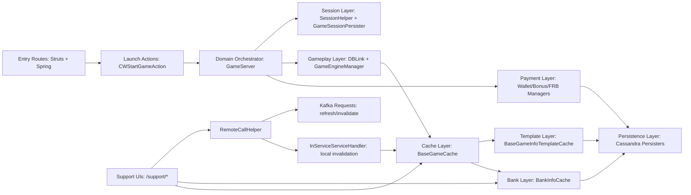
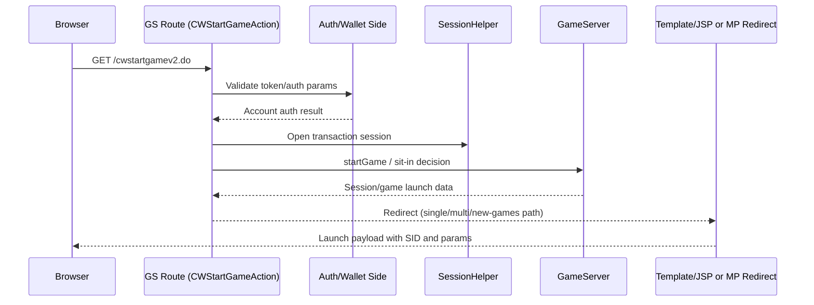
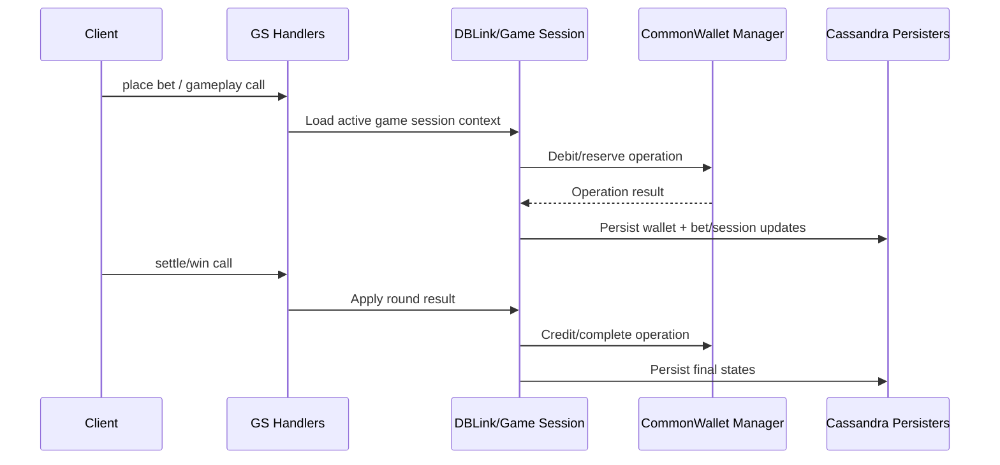
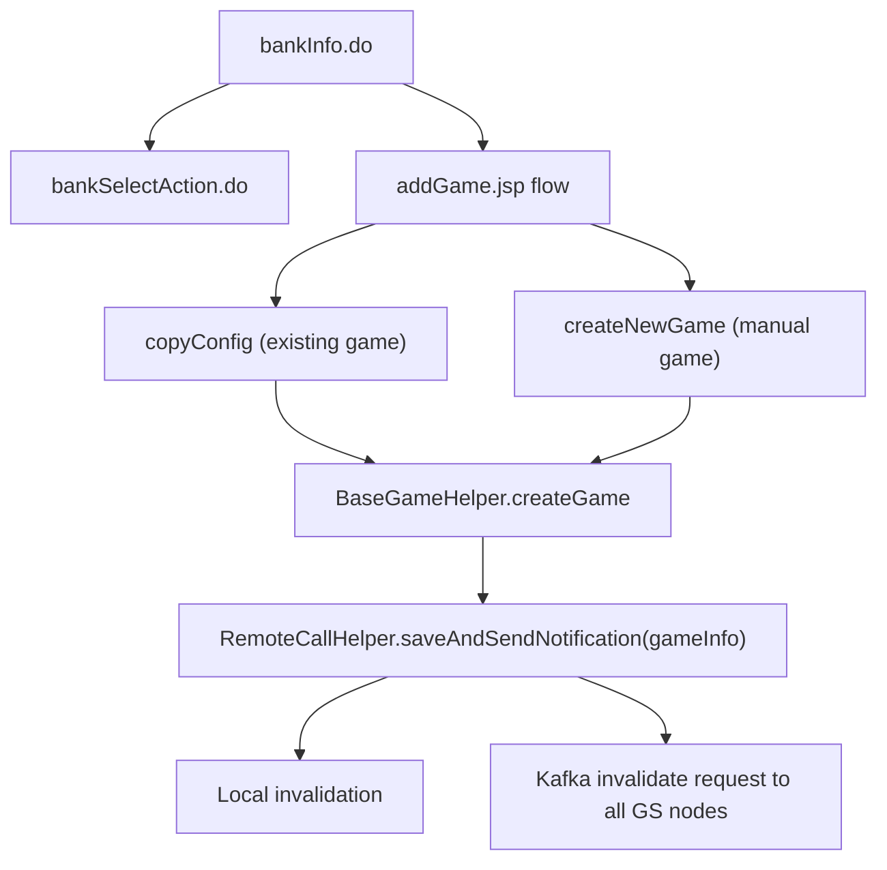

# GS Behavior Map and Runtime Flow Blueprint

Last updated: 2026-02-19 (UTC)
Audience: platform engineers, backend developers, support engineers, modernization team
Scope: Game Server (GS) behavior map for launch, gameplay, wallet, bonus/FRB, history, configuration, and observability

## 1. Purpose
This document is the implementation-level blueprint of how GS behaves today.
It is designed to be used as:
- a refactoring baseline (what must remain behaviorally equivalent),
- a production support map (where to inspect when incidents happen),
- a migration aid (what to reproduce in a new architecture).

## 2. Core Runtime Model
GS behavior is built from five interacting layers:
1. Entry layer: Struts/Spring routes and JSP tools (`web-gs`).
2. Domain layer: session/account/game orchestration (`common-gs`, `GameServer`).
3. Configuration/cache layer: bank/template/game objects (`common`, `sb-utils`, Cassandra-backed caches).
4. Payment layer: wallet, bonus, FRB managers.
5. Distributed propagation layer: local invalidation + cross-GS refresh/invalidate via Kafka/Thrift.

## 3. Module Dependency View

## 4. Launch Flow (Auth -> Session -> Redirect)
Primary route:
- `/cwstartgamev2.do` (Struts mapped to `CWStartGameAction`).

Key source anchors:
- `/Users/alexb/Documents/Dev/mq-gs-clean-version/game-server/web-gs/src/main/webapp/WEB-INF/struts-config.xml`
- `/Users/alexb/Documents/Dev/mq-gs-clean-version/game-server/web-gs/src/main/java/com/dgphoenix/casino/actions/enter/game/cwv3/CWStartGameAction.java`
- `/Users/alexb/Documents/Dev/mq-gs-clean-version/game-server/web-gs/src/main/java/com/dgphoenix/casino/actions/enter/game/BaseStartGameAction.java`
- `/Users/alexb/Documents/Dev/mq-gs-clean-version/game-server/common-gs/src/main/java/com/dgphoenix/casino/gs/GameServer.java`

Sequence:

Important launch branch points:
- Single-player vs multiplayer branch.
- Bonus/FRB mode branch.
- Maintenance mode gate.
- Pending wallet operation gate.
- New Games virtual route branch (`00010` by default unless overridden).

## 5. Gameplay/Wager/Settle Flow
The practical lifecycle for a round is:
1. Game opens with a valid SID and game session context.
2. Debit/bet path goes through wallet manager and operation tracking.
3. Win/settle path updates wallet and session/bet persistence.
4. Session state is tracked in transaction data and persisted asynchronously/synchronously based on path.

Sequence (abstracted):

Operational invariants to preserve in modernization:
- A round must not complete without a consistent wallet operation state.
- Session ownership and SID checks must stay strict (anti-mismatch behavior).
- FRB/bonus session states must preserve explicit close/finalize semantics.

## 6. Dynamic Coin and Game-Level Settings (GL)
This is configuration layering, not Java class inheritance.

Computation stack:
- `GameSettingsManager` orchestrates coin/default/frb decisions.
- `DynamicCoinManager` computes dynamic coins/default/frb coin.
- `GamesLevelHelper` applies min/max/max-win/coin-count filtering.
- `GamesLevelContext` resolves values from template + bank + game + currency conversion rules.

Key anchors:
- `/Users/alexb/Documents/Dev/mq-gs-clean-version/game-server/common-gs/src/main/java/com/dgphoenix/casino/gs/managers/game/settings/GameSettingsManager.java`
- `/Users/alexb/Documents/Dev/mq-gs-clean-version/game-server/common-gs/src/main/java/com/dgphoenix/casino/gs/managers/game/settings/DynamicCoinManager.java`
- `/Users/alexb/Documents/Dev/mq-gs-clean-version/game-server/common-gs/src/main/java/com/dgphoenix/casino/gs/managers/game/settings/GamesLevelHelper.java`
- `/Users/alexb/Documents/Dev/mq-gs-clean-version/game-server/common-gs/src/main/java/com/dgphoenix/casino/gs/managers/game/settings/GamesLevelContext.java`

Bank GL keys (examples):
- `GL_MIN_BET`, `GL_MAX_BET`, `GL_MAX_EXPOSURE`, `GL_DEFAULT_BET`,
- `GL_OFRB_BET`, `GL_USE_OFRB_BET_FOR_NONGL_SLOTS`,
- `GL_OFRB_OVERRIDES_PREDEFINED_COINS`, `GL_NUMBER_OF_COINS`, `GL_USE_DEFAULT_CURRENCY`.

Template inherited markers:
- `@InheritFromTemplate` in base constants (for example `GL_SUPPORTED`, `GL_MIN_BET_DEFAULT`, `GL_MAX_BET_DEFAULT`).
- Bank game editor blocks remove/reset/add for inherited properties.

## 7. Base Template vs Per-Bank Game Config
Current effective game settings are composed as:
1. Per-bank/per-currency game row (`BaseGameCache` entry) if present.
2. Missing properties filled from template default game info.
3. Missing limit/coins fallback to bank defaults depending on variable type.

Key logic:
- property merge in `BaseGameCache.extractProperties(...)`,
- coin fallback in `BaseGameCache.extractCoins(...)`,
- limit fallback in `BaseGameCache.extractLimit(...)`.

Master/slave bank behavior:
- If bank is configured as slave and no local game row exists, GS can expose immutable wrapper backed by master-bank game config.

## 8. Migration and Hook Points
### 8.1 Game migration map
- Config key: `GAME_MIGRATION_CONFIG` (`oldGameId=newGameId;...`).
- Resolver methods: `GameServer.getNewGame(...)`, `GameServer.getOldGames(...)`.
- Observed active use: bonus game validity checks map old/new IDs during migration scenarios.

### 8.2 Session state listener hook
- Bank property key: `GAME_SESSION_STATE_LISTENER`.
- Factory loads class by name (`GameSessionStateListenersFactory`) and defaults to NOOP.
- Listener receives `START`/`CLOSE` state callbacks.

### 8.3 Extended gameplay processor hook
- Interface exists: `IExtendedGameplayProcessor`.
- Bank property key exists: `EXTENDED_GAMEPLAY_PROCESSOR`.
- Current codebase scan did not find active runtime wiring in this repository line.

## 9. Support/Admin Config Flows (Bank/Game)
Main support routes:
- `bankSupport.do` -> bank selector list.
- `bankSelectAction.do` -> bank property editor preload and redirect helpers.
- `bankInfo.do` -> bank summary and game/currency navigation.
- `copyConfig`, `createNewGame`, `loadgameinfo`, `editgameprop` -> game config CRUD.

Flow overview:

Versioning/concurrency protections:
- Editor actions compare loaded object snapshot vs current cache object and block unsafe concurrent edits.

## 10. Config Refresh and Invalidation
Refresh/invalidation channels:
- Thrift API (`refreshConfig`, invalidate wallet/bonus/frb/game cache methods).
- Local handler execution (`InServiceServiceHandler`).
- Cross-node Kafka async fan-out (`RemoteCallHelper`).

This is directly related to game onboarding:
- when a game/bank/template is changed and saved through support actions, GS propagates invalidation so all nodes pick up new config.

## 11. History Flows (`historyByRound`, `historyByToken`)
Routes:
- `/vabs/historyByRound.do?ROUNDID=<id>`
- `/vabs/historyByToken.do?token=<token>`

Behavior:
- `historyByRound` resolves round -> session list -> redirect to `/vabs/show.jsp`.
- `historyByToken` resolves token -> roundId via history token table, then same redirect logic.

Current environment observation (2026-02-19 UTC):
- `rcasinoks.historytokencf`: 0 rows.
- `rcasinoks.roundgamesessioncf`: 0 rows.
- `rcasinoks.gamesessioncf`: contains recent sessions.

Resulting runtime behavior now:
- round/token history links with unknown values return "not found" pages, which is expected under current data state.

## 12. API Issues and Metrics Tooling
### 12.1 API Issues dashboard
- Path: `/support/showAPIIssues.do`.
- Reads per-day URL success/failure counters from Cassandra.
- Supports filtering, sorting, date windows (up to 30 days in UI checks).
- Highlights high failure-percent rows.

### 12.2 Metrics UI
- Path: `/support/metrics/`.
- Draws selected metric by server and time range.
- Uses raw points for short windows, aggregated avg/min/max for long windows.

## 13. Virtual Route `00010` vs Persisted Game Rows
`00010` (Plinko/New Games phase route) was implemented as virtual routing, not standard bank `gameinfocf` onboarding.

Consequences:
- Some legacy tools relying on persisted game rows do not see it by default.
- Additional custom handling was needed (for launch validation bypass, gamelist virtual entry, etc.).

Recommendation for future titles:
- use proper persisted template + per-bank game rows unless virtual route behavior is intentionally required.

## 14. Runtime Observability Playbook
### 14.1 Trace capture pattern
Example artifact generated in this workspace:
- `/Users/alexb/Documents/Dev/tmp/gs-trace-20260219-150647.log`

Trace content should include:
1. pre-tail logs,
2. deterministic endpoint probes,
3. focused grep section for target actions/errors,
4. timestamped boundaries (`TRACE_START`, `TRACE_END`).

### 14.2 Incident triage sequence
1. Confirm route response code and body snippet.
2. Extract matching action logs by timestamp.
3. Confirm cache state and recent invalidations.
4. Confirm backing Cassandra rows for expected entities.
5. Re-test with controlled token/round/session IDs.

## 15. Modernization Guardrails (Behavioral Equivalence)
Critical behaviors to preserve:
- strict SID/session mismatch handling,
- wallet operation state integrity across round lifecycle,
- propagation semantics for config changes,
- template/bank/game fallback logic,
- dynamic GL calculations with currency conversion and max-win constraints,
- bonus/FRB validity checks including migration map compatibility.

High-risk refactor zones:
- launch branching and mode transitions,
- cross-node invalidation timing,
- cache load fallback order,
- session close and listener/hook side effects,
- partial migration between virtual and persisted game onboarding models.

## 16. Quick Reference: Key Files
- Launch/action flow:
  - `/Users/alexb/Documents/Dev/mq-gs-clean-version/game-server/web-gs/src/main/java/com/dgphoenix/casino/actions/enter/game/cwv3/CWStartGameAction.java`
- Core game server orchestration:
  - `/Users/alexb/Documents/Dev/mq-gs-clean-version/game-server/common-gs/src/main/java/com/dgphoenix/casino/gs/GameServer.java`
- Dynamic settings:
  - `/Users/alexb/Documents/Dev/mq-gs-clean-version/game-server/common-gs/src/main/java/com/dgphoenix/casino/gs/managers/game/settings/GameSettingsManager.java`
- Bank/game support actions:
  - `/Users/alexb/Documents/Dev/mq-gs-clean-version/game-server/web-gs/src/main/webapp/WEB-INF/struts-config.xml`
- Refresh/invalidation propagation:
  - `/Users/alexb/Documents/Dev/mq-gs-clean-version/game-server/common-gs/src/main/java/com/dgphoenix/casino/gs/persistance/remotecall/RemoteCallHelper.java`
- History endpoints:
  - `/Users/alexb/Documents/Dev/mq-gs-clean-version/game-server/web-gs/src/main/java/com/dgphoenix/casino/actions/api/history/vba/HistoryByRoundAction.java`
  - `/Users/alexb/Documents/Dev/mq-gs-clean-version/game-server/web-gs/src/main/java/com/dgphoenix/casino/actions/api/history/vba/HistoryByTokenAction.java`

