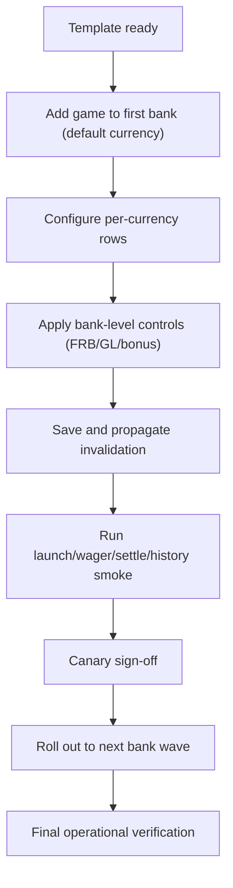

# New Team Onboarding and New Game Playbook (GS)

Last updated: 2026-02-19 (UTC)
Audience: new backend engineers, support engineers, game developers integrating new titles into GS

## 1. Why This Exists
This document is the operational and engineering manual for teams that will:
- run and support the current GS,
- onboard new games correctly,
- avoid fragile shortcuts that create hidden support overhead.

It is intentionally detailed and procedural.

## 2. Direct Answer: Why `00010` Needed Extra Manual Handling
Yes, this was a major reason.

`00010` was implemented as a virtual launch route (New Games path), not as a normal persisted bank game row (`gameinfocf` style model).
That means many existing legacy/admin paths that expect persisted game configs did not automatically see or manage it.

Practical impact of virtual-only onboarding:
- some lists and support tools needed custom behavior,
- additional routing exceptions/validation bypasses were required,
- support consistency depended on custom patches instead of standard config lifecycle.

Future recommendation:
- for regular game rollout, use standard persisted onboarding (template + per-bank game config + propagation).
- reserve virtual route usage for explicitly planned gateway/migration architecture.

## 3. Team Model and Responsibilities
### 3.1 Runtime support team
Owns:
- incident triage,
- cache/invalidation health,
- wallet/bonus/frb connectivity,
- metrics/API-issues monitoring,
- release verification and rollback execution.

### 3.2 Game integration team
Owns:
- template readiness,
- per-bank/per-currency game configuration,
- property correctness,
- game-level limits/coins,
- post-deploy smoke tests.

### 3.3 Platform/refactor team
Owns:
- behavior-preserving modernization,
- observability parity,
- migration-compatible data and API contracts,
- rollout tooling and automation.

## 4. Required Access and Environment Prerequisites
Minimum required access:
- source repositories for `mq-gs-clean-version`, `mq-mp-clean-version`, dependent services,
- container runtime access (GS, MP, Cassandra, related services),
- Cassandra query access,
- support/admin endpoints access,
- logs access for GS/MP.

Minimum runtime components to verify before onboarding a game:
1. GS container is up and healthy.
2. MP container is up and healthy (if MP/mixed flows are used).
3. Cassandra is reachable and keyspaces are queryable.
4. wallet/auth endpoints are reachable for target bank.
5. support endpoints are reachable (`/support/*`).

## 5. Source and Runtime Landmarks
Core locations:
- Struts route map:
  - `/Users/alexb/Documents/Dev/mq-gs-clean-version/game-server/web-gs/src/main/webapp/WEB-INF/struts-config.xml`
- Bank/game support actions:
  - `/Users/alexb/Documents/Dev/mq-gs-clean-version/game-server/web-gs/src/main/java/com/dgphoenix/casino/support/cache/bank/edit/actions/`
- Core game orchestration:
  - `/Users/alexb/Documents/Dev/mq-gs-clean-version/game-server/common-gs/src/main/java/com/dgphoenix/casino/gs/GameServer.java`
- Cache/config composition:
  - `/Users/alexb/Documents/Dev/mq-gs-clean-version/common/src/main/java/com/dgphoenix/casino/common/cache/BaseGameCache.java`
  - `/Users/alexb/Documents/Dev/mq-gs-clean-version/common/src/main/java/com/dgphoenix/casino/common/cache/BaseGameInfoTemplateCache.java`
- Invalidation propagation:
  - `/Users/alexb/Documents/Dev/mq-gs-clean-version/game-server/common-gs/src/main/java/com/dgphoenix/casino/gs/persistance/remotecall/RemoteCallHelper.java`

## 6. Configuration Model You Must Understand
Effective game behavior is layered:
1. Base template defaults (`BaseGameInfoTemplate`).
2. Bank-level defaults/properties (`BankInfo`).
3. Per-bank/per-currency game overrides (`BaseGameInfo`).
4. Runtime dynamic calculations (GL/dynamic coins/frb coin).

### 6.1 Inheritance policy
- Some game properties are marked `@InheritFromTemplate` and are intentionally protected from free per-bank overrides.
- Game editor action enforces this during add/remove/reset operations.

### 6.2 Fallback behavior
If per-game values are missing:
- properties are filled from template defaults,
- limit/coins fallback to bank defaults according to variable type.

This fallback is operationally critical and must be preserved in refactors.

## 7. Required Config Keys and Settings (Operational Set)
This is not the full universe of keys; it is the practical set used during onboarding/support.

### 7.1 Bank-level keys (selected, high-impact)
- Migration/hooks:
  - `GAME_MIGRATION_CONFIG`
  - `MIGRATION_STATUS`
  - `GAME_SESSION_STATE_LISTENER`
  - `EXTENDED_GAMEPLAY_PROCESSOR` (declared hook; runtime wiring must be validated per deployment)
- Game-level controls (GL):
  - `GL_MIN_BET`, `GL_MAX_BET`, `GL_MAX_EXPOSURE`, `GL_DEFAULT_BET`
  - `GL_OFRB_BET`, `GL_USE_OFRB_BET_FOR_NONGL_SLOTS`, `GL_OFRB_OVERRIDES_PREDEFINED_COINS`
  - `GL_NUMBER_OF_COINS`, `GL_USE_DEFAULT_CURRENCY`
- FRB bank filtering:
  - `FRB_GAMES_ENABLE` / `FRB_GAMES_DISABLE` (mutually exclusive in editor validation)
- History:
  - history offset/timezone/token ttl related settings
- New Games route controls (if intentionally using virtual route style):
  - `NEW_GAMES_ROUTE_GAME_ID`
  - `NEW_GAMES_CLIENT_URL`
  - `NEW_GAMES_API_URL`
  - `NEW_GAMES_GS_INTERNAL_BASE_URL`

### 7.2 Game-level keys (selected, onboarding-critical)
- Core enable/test/image:
  - `ISENABLED`, `GAME_TESTING`, `GAME_IMAGE_URL`
- Core betting:
  - `DEFCOIN`, `DEFAULTBETPERLINE`, `DEFAULTNUMLINES`
  - `MAX_BET_1/2/3/...`
- FRB-specific:
  - `FRB_COIN`, `FRB_BPL`, `FRB_NUMLINES`
- GL game-level overrides:
  - `GL_SUPPORTED` (template-level inherited support flag)
  - `GL_MIN_BET`, `GL_MAX_BET`, `GL_MAX_EXPOSURE`, `GL_DEFAULT_BET`, `GL_NUMBER_OF_COINS`

## 8. Standard New Game Rollout: Correct Process
This is the primary routine for future games.

Rollout flow:

### Phase 0: Readiness
1. Confirm game identity and ownership:
   - gameId strategy,
   - game name/title,
   - group/type/variableType,
   - RM/GS class requirements.
2. Confirm template requirements exist (or create them):
   - default properties,
   - localization/languages,
   - image URL,
   - RTP/volatility/max-win requirements.
3. Confirm target banks and currencies list.

### Phase 1: Template preparation
1. Create/update `BaseGameInfoTemplate` with production defaults.
2. Ensure inherited properties are correctly flagged and aligned with design.
3. Save and propagate template changes (refresh across GS nodes).

Validation:
- template is queryable in cache,
- no missing mandatory defaults for launch/runtime logic.

### Phase 2: Add game to first bank (default currency)
Preferred operator path:
1. Open bank support page (`bankInfo.do?bankId=<id>`).
2. Use add-game flow:
   - `copyConfig` if cloning an existing equivalent game,
   - `createNewGame` for clean manual setup.
3. Open `loadgameinfo` and finalize properties/limit/coins/classes.
4. Save via `editgameprop`.

System effect:
- persisted game config update,
- `saveAndSendNotification(gameInfo)` call,
- local invalidate + cross-node invalidate request.

### Phase 3: Add game to all required currencies in bank
1. For each currency, validate game row exists and has expected overrides.
2. Use editor option for all-currency property sync only when intended.
3. Re-check inherited-property constraints before forcing any reset/remove action.

### Phase 4: Add game to other banks
Two approved paths:
1. Repeat standard support flow per bank (lower blast radius, clearer audit).
2. Controlled bulk path via `/support/gameBankConfig/applyGame.jsp` with strict operator checklist.

Bulk path caution:
- powerful and fast, but easier to make wide mistakes.
- require dry-run/report style comparison before applying.

### Phase 5: Bank-level controls and compatibility checks
1. Verify FRB and bonus game inclusion logic for new game.
2. Verify GL constraints at bank level if dynamic levels are active.
3. Verify bank/master-slave implications for the game.

### Phase 6: Runtime validation (must pass)
Required smoke tests per target bank:
1. Launch route returns valid redirect/session payload.
2. Game opens with correct language and mode.
3. Manual bet/debit and settle/win complete.
4. Balance updates are consistent.
5. Session close/re-open works without mismatch errors.
6. History availability is correct for generated rounds/tokens.

### Phase 7: Operational validation
1. `/support/metrics/` shows healthy runtime behavior around deployment window.
2. `/support/showAPIIssues.do` does not show regression for affected APIs.
3. No repeating errors in GS logs for new game classes/config.

### Phase 8: Rollback plan
Before rollout finalize:
1. Record old template and game-config snapshots.
2. Define precise rollback target per bank/currency.
3. Validate rollback propagation path and operator command pack.

## 9. Routine Instructions: Add a New Game to Each Bank
Use this checklist exactly.

1. Select release wave:
   - canary bank(s), then full bank set.
2. Verify template readiness and required game-level defaults.
3. For each bank:
   - add game row (copy/create),
   - set game properties,
   - set per-currency values,
   - verify FRB/bonus inclusion policy,
   - save and confirm invalidation propagated.
4. Execute launch + wager + settle smoke per bank.
5. Log outcome per bank in rollout sheet.
6. Only then continue to next wave.

Do not skip per-bank runtime validation even if config diff looks identical.

## 10. What Not To Do
1. Do not rely on virtual route-only onboarding for normal game rollout.
2. Do not edit inherited template properties via unsupported shortcuts.
3. Do not skip propagation checks after config saves.
4. Do not perform bulk rollout without comparison report and rollback plan.
5. Do not assume history/token tables will populate without verifying flow-specific writes.

## 11. Support Incident Runbook for New Game Rollouts
When incident occurs after rollout:
1. Identify affected bankId/gameId/currency/mode/sessionId/time window.
2. Confirm launch route and response body quickly.
3. Pull focused GS logs around action/handler names.
4. Verify live cache object values for bank/game/template.
5. Verify Cassandra rows for game/session/bet/history mappings.
6. If config issue, apply correction and force propagation.
7. Re-test with deterministic scenario and document final state.

## 12. Minimal Verification Commands (Examples)
### 12.1 Endpoint probes (inside GS container)
- `curl http://localhost:8080/support/bankInfo.do?bankId=<id>`
- `curl http://localhost:8080/support/loadgameinfo.do?bankId=<id>&curCode=<ccy>&gameId=<gid>`
- `curl http://localhost:8080/support/metrics/`
- `curl http://localhost:8080/support/showAPIIssues.do`

### 12.2 History diagnostics
- `curl "http://localhost:8080/vabs/historyByRound.do?ROUNDID=<rid>"`
- `curl "http://localhost:8080/vabs/historyByToken.do?token=<token>"`

### 12.3 Cassandra checks (examples)
- count round-token mappings,
- inspect recent `gamesessioncf` rows,
- confirm game config persistence by bank/game/currency keys.

## 13. Definition of Done (New Game Onboarded)
A game is considered onboarded only when all are true:
1. Template and per-bank configs are persisted and propagated.
2. Launch path works in target modes.
3. Wager and settle lifecycle is clean.
4. FRB/bonus behavior matches product expectation.
5. History behavior is validated for actual generated rounds/tokens.
6. Support dashboards and logs show no regression patterns.
7. Rollback package is documented and tested.

## 14. Reference Documents
- Behavior blueprint:
  - `/Users/alexb/Documents/Dev/docs/16-gs-behavior-map-and-runtime-flow-blueprint.md`
- Launch forensics baseline:
  - `/Users/alexb/Documents/Dev/docs/11-game-launch-forensics.md`
- Active work diary:
  - `/Users/alexb/Documents/Dev/docs/12-work-diary.md`
- Infrastructure tools catalog:
  - `/Users/alexb/Documents/Dev/docs/15-gs-infrastructure-tools-catalog.html`

## 15. Known Caveats in Current Line
1. Compare routes `/support/compare/banks.do` and `/support/compare/gameTemplates.do` are mapped in Struts but return runtime HTTP 500 in current local line because referenced differencer implementation is not present in this repo tree.
2. Working compare alternative exists at `/support/gameBankConfig/compareBanksGames.jsp`.
3. Virtual-route onboarding (like `00010`) is operationally valid but should not replace standard persisted onboarding for normal production game rollout.
