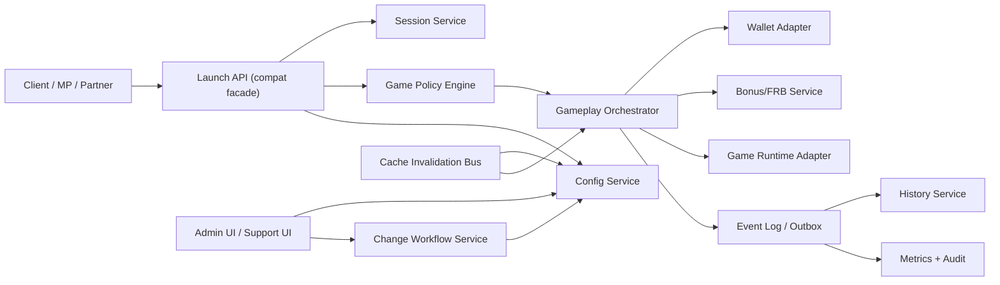

# GS Modernization Architecture Recommendations (2026)

Last updated: 2026-02-19 (UTC)
Audience: architecture board, backend leads, platform engineers, game-integration team, support leads
Scope: behavior-preserving rebuild of GS with stronger configurability, performance, and operability

## 1. Executive Summary
The right strategy is not a big-bang rewrite.  
The right strategy is a staged modernization that:
1. Preserves critical production behavior (wallet consistency, session integrity, launch compatibility).
2. Externalizes configuration and policy logic to remove hidden coupling.
3. Extracts high-churn responsibilities from legacy monolith paths into independently deployable services.
4. Introduces deterministic observability and replay tooling so migration risk is measurable.

Primary business outcome:
- Same current game functionality,
- Faster onboarding of new games/banks,
- Lower incident volume and shorter MTTR,
- Better throughput/latency under load.

## 2. Current-State Diagnosis (What Slows Us Down)
Based on source and runtime behavior maps:
1. Runtime responsibility concentration:
   - launch, policy, wallet/bonus decisioning, and config composition are tightly coupled in GS paths.
2. Configuration complexity:
   - template/bank/game layering exists, but it is implicit in code and hard to audit/change safely.
3. Invalidation fan-out complexity:
   - mixed local + remote propagation is operationally sensitive and hard to reason about during incidents.
4. Support and admin workflows:
   - many actions are powerful but not opinionated enough for safe repeatable change.
5. Virtual routing exceptions:
   - virtual-only game onboarding (like `00010`) bypasses standard persisted flow and increases manual support load.
6. Hook architecture inconsistency:
   - some extension points exist but are weakly standardized and inconsistently wired.

## 3. Architecture Principles for Rebuild
1. Behavior parity first:
   - all critical old paths get contract tests and replay parity before cutover.
2. Strangler pattern:
   - old endpoints stay alive while new services gradually take ownership.
3. Config as product:
   - configuration becomes versioned, validated, and diffable (not hidden runtime side effects).
4. Idempotent financial operations:
   - debit/credit/state transitions must be replay-safe and idempotent by design.
5. Observable by default:
   - every cross-service and cross-policy decision is traceable with correlation IDs.
6. Operationally reversible changes:
   - feature flags and compatibility switches enable rapid rollback.

## 4. Target Architecture (Recommended)

### 4.1 Service Boundaries
1. Launch API (compat facade):
   - preserves legacy route contracts while delegating logic to new services.
2. Session Service:
   - owns session lifecycle, ownership checks, anti-mismatch, and state machine.
3. Config Service:
   - owns template/bank/game configs, inheritance rules, versioning, and validation.
4. Game Policy Engine:
   - computes effective launch/gameplay policy (GL, coins, FRB conditions, migration mapping).
5. Gameplay Orchestrator:
   - executes wager/settle flows with strict idempotent operation handling.
6. Wallet Adapter:
   - normalized resilient integration for debit/credit/reserve semantics.
7. Bonus/FRB Service:
   - centralizes FRB/bonus eligibility, award usage, and lifecycle transitions.
8. History Service:
   - stores and queries round/token/session history from event stream.
9. Change Workflow Service:
   - safe admin operations with dry-run, diff preview, approval, and rollout tracking.

## 5. Data and Configuration Model Redesign
### 5.1 Explicit configuration inheritance graph
Replace hidden merge behavior with explicit precedence:
1. `TemplateDefaults`
2. `BankDefaults`
3. `BankGameOverrides`
4. `CurrencyOverrides`
5. `RuntimePolicyTransforms` (for GL/dynamic coin conversions)

Each effective field must include metadata:
- source layer,
- rule applied,
- version hash.

Why better:
- faster debugging of “why this value?” questions,
- safer change reviews,
- deterministic diff and rollback.

### 5.2 Versioned config snapshots
Every published config change creates:
1. immutable snapshot ID,
2. changelog entry (who/what/why),
3. rollout status by node/cluster.

Why better:
- auditable operations,
- immediate rollback to known-good snapshot,
- cleaner incident recovery.

### 5.3 Policy DSL for launch/game-level rules
Introduce a restricted policy DSL for:
- game migration mapping,
- GL constraints,
- FRB include/exclude,
- bank compatibility flags.

Why better:
- removes hardcoded per-bank branches,
- enables controlled extension without core code changes.

## 6. Gameplay Reliability and Financial Safety
### 6.1 Operation ledger and idempotency keys
For every wager/settle:
1. assign global operation ID,
2. enforce idempotency key on wallet calls,
3. persist transition state machine (`INIT -> RESERVED -> SETTLED/CANCELED`).

Why better:
- protects from duplicates/retries/timeouts,
- simplifies reconciliation.

### 6.2 Outbox/event log for side effects
Commit gameplay state and outbound events atomically using outbox pattern.

Why better:
- prevents “state saved but event lost” failures,
- deterministic downstream history/metrics updates.

### 6.3 Deterministic session state machine
Formalize transitions for start/pause/close/mismatch recovery.

Why better:
- fewer ambiguous errors,
- easier multi-tab/reconnect handling.

## 7. Performance Plan
### 7.1 Hot-path latency targets
Set SLO targets:
1. launch API p95 < 120ms (excluding external auth latency),
2. wager/settle orchestration p95 < 90ms internal processing,
3. config lookup p99 < 10ms from cache.

### 7.2 Caching strategy
1. L1 local in-process cache for effective configs.
2. L2 distributed cache keyed by `(bank, game, currency, configVersion)`.
3. Pull-based refresh + push invalidation with monotonic version checks.

Why better:
- lower recomputation overhead,
- elimination of stale overwrite races.

### 7.3 Async and batching improvements
1. write-heavy side data (history/metrics/audit) via event stream consumers.
2. batched persistence for non-critical telemetry.
3. connection pooling tuning and timeout budgets per dependency.

## 8. Extension and New Game SDK
### 8.1 First-class plugin model
Define stable interfaces:
1. `GameLaunchAdapter`
2. `GameplayAdapter`
3. `ResultTranslator`
4. `CapabilityDescriptor` (supports FRB, GL, lines, etc.)

Why better:
- new game integration without touching core orchestration logic,
- explicit compatibility metadata.

### 8.2 Hook governance
All custom hooks (listener/extended processor style) must be:
1. declared in registry,
2. feature-flagged,
3. typed and testable,
4. observable with per-hook metrics.

Why better:
- removes “mystery hooks” and runtime surprises,
- safer bank-specific customization.

## 9. Admin and Support UX Redesign
### 9.1 Safe change workflow
Every change should support:
1. draft,
2. dry-run diff,
3. validation,
4. approval,
5. scheduled rollout,
6. rollback action.

### 9.2 New-game onboarding wizard
Wizard steps:
1. select template base,
2. set bank/currency overrides,
3. validate FRB/GL compatibility,
4. generate rollout checklist automatically.

Why better:
- fewer manual misses,
- consistent onboarding quality across operators.

### 9.3 Compare and diagnostics
Replace fragile compare pages with robust API-backed diff:
- compare banks,
- compare game templates,
- compare effective values by source layer.

## 10. Observability and Operational Excellence
### 10.1 Unified telemetry contract
Mandatory fields for each request/event:
- `traceId`, `sessionId`, `bankId`, `gameId`, `operationId`, `configVersion`.

### 10.2 Golden signals and dashboards
Dashboards:
1. launch success/failure by reason,
2. wager/settle latency and error class,
3. wallet dependency SLA,
4. config propagation lag,
5. FRB/bonus decision rejection reasons.

### 10.3 Incident replay toolkit
Store minimal normalized event trail to replay:
- launch request,
- policy resolution,
- wallet calls,
- final state transitions.

Why better:
- root cause in minutes, not hours,
- safer regression investigation during migration.

## 11. Security and Compliance Upgrades
1. Secrets in managed vault; no plain config secrets.
2. Signed/admin-authenticated support actions.
3. RBAC for change scopes (view/edit/publish/rollback).
4. Immutable audit log for financial-impacting changes.
5. PII minimization and tokenization for history/search.

## 12. Migration Strategy (Phased)
### Phase 0: Baseline and parity harness (4-6 weeks)
1. Define canonical behavior matrix from current GS.
2. Build traffic replay and snapshot-based contract tests.
3. Freeze undocumented behavior by writing explicit tests.

Exit criteria:
- parity suite green for top game families and top banks.

### Phase 1: Observability-first retrofit (3-4 weeks)
1. add correlation IDs across old GS hot paths,
2. add missing telemetry and reason codes,
3. build migration dashboard baseline.

Exit criteria:
- incident triage and latency tracking complete in one place.

### Phase 2: Config Service extraction (6-8 weeks)
1. build versioned config store and effective-config API,
2. dual-read old and new config paths,
3. switch read path behind flag.

Exit criteria:
- all launch and gameplay policy reads served by new config service.

### Phase 3: Launch and session extraction (6-10 weeks)
1. move launch/session logic to new services behind compat facade,
2. keep legacy endpoints, route internals to new services.

Exit criteria:
- launch/session traffic >80% on new path with zero behavior regression.

### Phase 4: Gameplay orchestrator and financial path (8-12 weeks)
1. implement idempotent wager/settle pipeline,
2. integrate wallet adapter and outbox,
3. run mirrored validation mode before full cutover.

Exit criteria:
- financial reconciliation error rate within agreed threshold.

### Phase 5: Admin/support modernization (4-6 weeks)
1. onboarding wizard, compare API, rollout workflow,
2. remove highest-risk manual steps.

Exit criteria:
- new game onboarding lead time reduced by at least 50%.

### Phase 6: Legacy decommission (ongoing)
1. disable obsolete code paths,
2. archive compatibility shims,
3. retain replay tools and runbooks.

## 13. Specific Recommendation for Future New Games
1. Do not use virtual-only onboarding for normal games.
2. Use persisted template + bank game rows + versioned publish pipeline.
3. Require automated per-bank/currency rollout checklist.
4. Require parity smoke pack:
   - launch,
   - wager/debit,
   - settle/credit,
   - reconnect/session recovery,
   - FRB/bonus scenario,
   - history/token retrieval.

## 14. What to Keep vs Replace
Keep:
1. proven domain behaviors (wallet consistency, strict SID validation, FRB state transitions),
2. template/bank/game conceptual layering,
3. support for bank-specific customization.

Replace:
1. monolithic route-centric orchestration,
2. implicit config merge and opaque invalidation mechanics,
3. ad-hoc support actions lacking safe workflow controls.

Deprecate:
1. virtual-only game rollout as default practice,
2. untyped hook loading without registry/validation.

## 15. Target KPIs for Modernization Program
1. New game onboarding time:
   - baseline -> target: reduce by 50-70%.
2. Change failure rate:
   - target: <5% for config/game rollout changes.
3. MTTR for incidents:
   - target: reduce by 40%.
4. Launch failure rate:
   - target: <0.5% excluding upstream dependency outages.
5. Config propagation lag:
   - target: p99 < 15 seconds cluster-wide.
6. Financial reconciliation mismatches:
   - target: zero unreconciled critical mismatches.

## 16. Program Risks and Mitigations
1. Risk: hidden legacy behavior discovered late.
   - Mitigation: replay parity harness and golden test packs from day 1.
2. Risk: phased dual-run complexity.
   - Mitigation: strict feature flags, progressive bank canaries, instant fallback switch.
3. Risk: team context split between old and new systems.
   - Mitigation: single operational runbook and weekly architecture review cadence.
4. Risk: performance regressions from service boundaries.
   - Mitigation: benchmark gates and cache design validated before high-traffic cutover.

## 17. Suggested Governance Model
1. Architecture Review Board:
   - approves boundary contracts and deprecation policy.
2. Compatibility Owner:
   - owns legacy parity tests and backward compatibility matrix.
3. Financial Integrity Owner:
   - owns ledger/idempotency/reconciliation controls.
4. Operational Excellence Owner:
   - owns SLOs, alerting standards, and incident postmortem quality.

## 18. Immediate Next Preparation Steps
1. Build a full endpoint-to-domain capability matrix from current GS routes.
2. Build a config key catalog with owner/type/default/validation/fallback metadata.
3. Build a migration backlog grouped by service boundary.
4. Define first canary bank set and acceptance criteria.
5. Prepare parity test harness for top 10 games by traffic.

---
This document is the architecture recommendation baseline for discussion and iteration before refactor execution starts.
