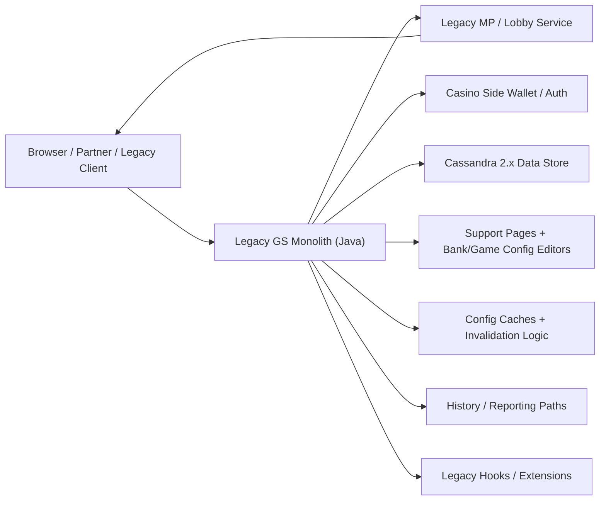
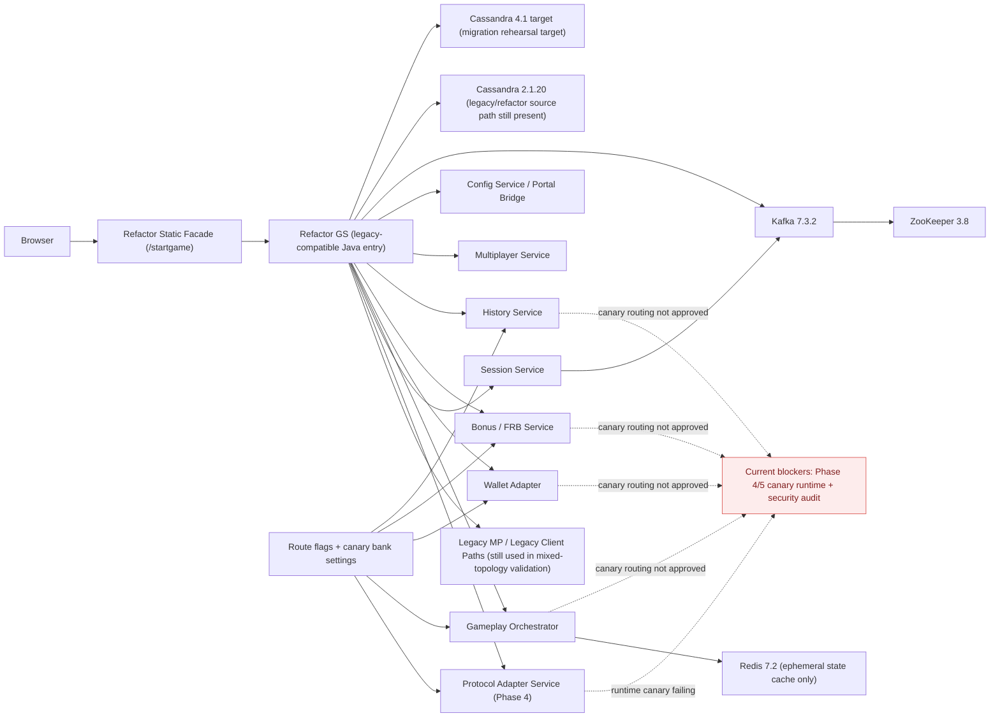
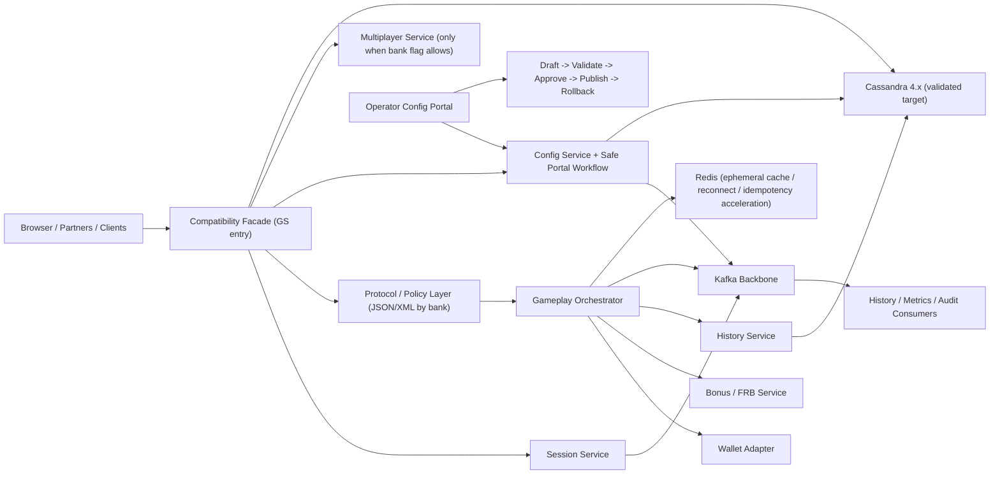
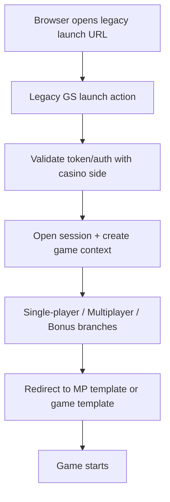
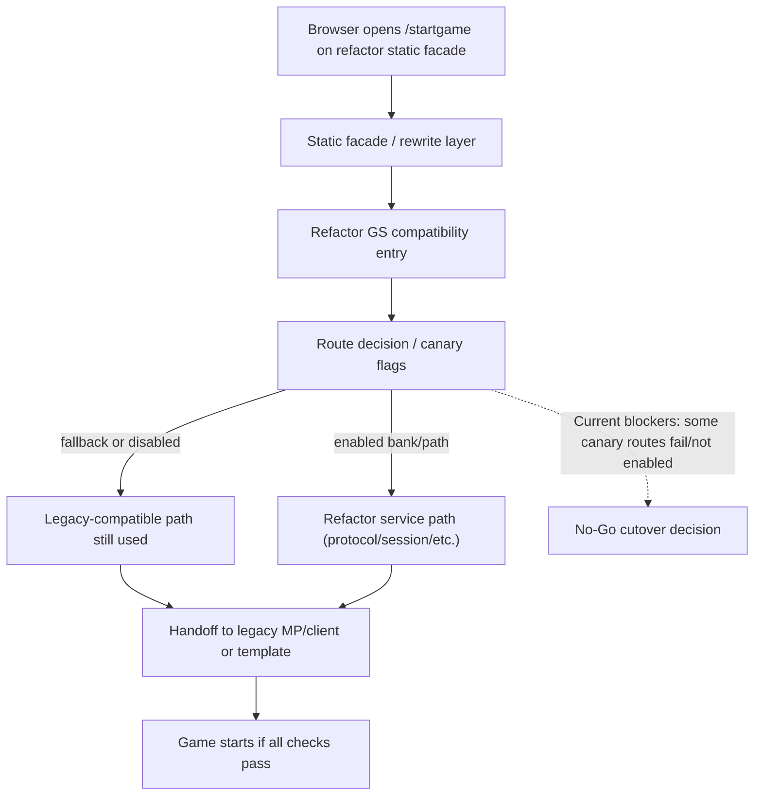
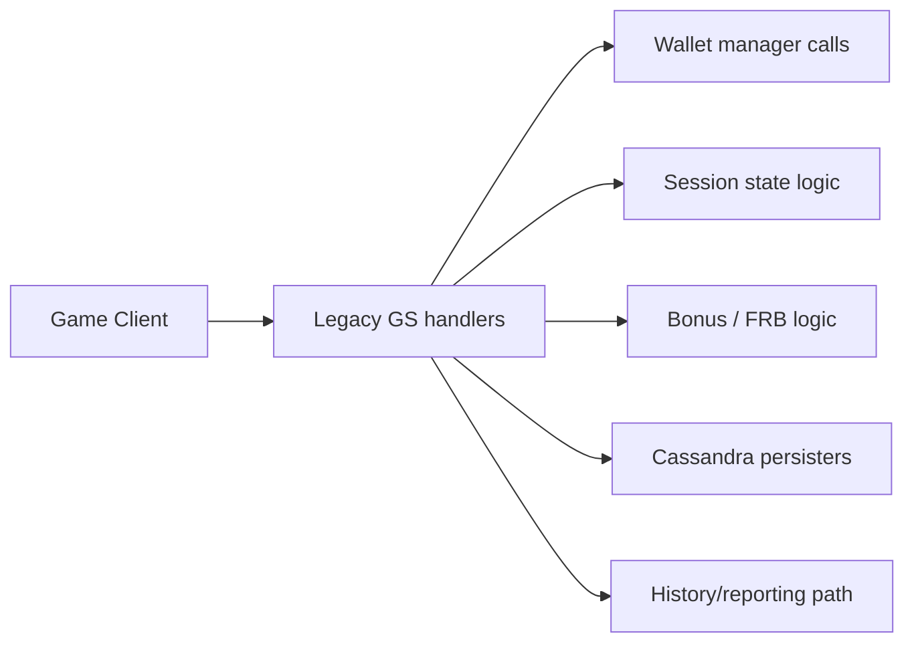
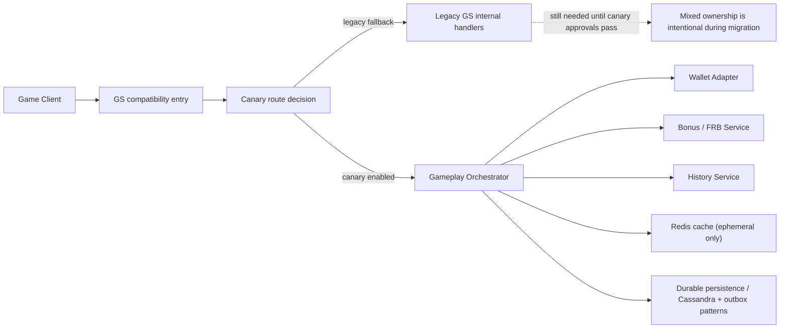
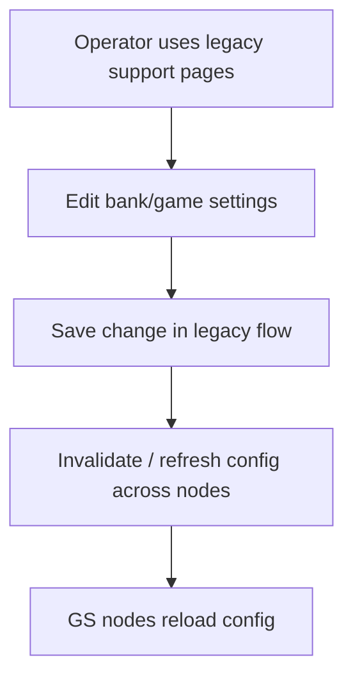
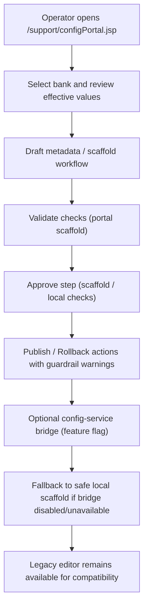
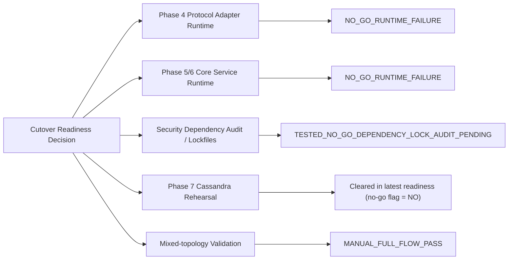

# Architecture & Workflow Visual Pack (Milestone 4)

Last updated: 2026-02-25 (UTC)
Audience: non-technical stakeholders, project owners, support leads

## Executive Summary (Simple English)
This document shows what the Game Server system looked like before the modernization work, what it looks like now, and what the target cutover-ready shape is supposed to be.

Important: the project has many completed deliverables, but the system is still **not approved for production cutover**. The current blocker is not "missing architecture ideas". The blocker is mainly runtime canary validation and security dependency audit work.

Current factual status (from the latest readiness report):
- Checklist completion: `41/41`
- Cutover readiness: `NO_GO_CUTOVER_PENDING_VALIDATION`
- Main blockers: Phase 4 runtime canary, Phase 5/6 runtime canary, security dependency audit/lockfiles

## 1. Before Project: Legacy GS Architecture (Baseline)

How to read this:
This is the starting point. Most important work happens inside one large Java application (the legacy GS monolith). It talks directly to wallet/auth systems, Cassandra, multiplayer paths, config logic, and support tools.

## 2. After Project (Current State): Mixed Modernization Runtime (Today)

How to read this:
The architecture is now split into multiple services, but the cutover is still partial. The refactor GS is acting as the compatibility entry point while some new services are running but not yet approved for traffic ownership (because canary checks are failing or not enabled).

## 3. Target Cutover-Ready Architecture (What the project is trying to reach)

How to read this:
This is the intended end-state design direction. The key idea is not "replace everything at once". The key idea is controlled routing and service ownership with rollback options, while keeping compatibility at the entry layer.

## 4. What Changed vs What Stayed Legacy (Simple Comparison)

| Area | Before Project | Current State (Today) | Target Cutover-Ready State |
|---|---|---|---|
| Entry point for game launch | Legacy GS route (`/cwstartgamev2.do`) | Legacy route still works; browser-facing alias `/startgame` added via refactor static facade | Compatibility facade remains, legacy route can stay for compatibility while internal routing is modernized |
| Core execution shape | Mostly one Java monolith path | Mixed: refactor GS entry + extracted services running + legacy fallback/canary routing | Service ownership moved to extracted services behind controlled routing |
| Multiplayer handling | Legacy MP tightly coupled path | Mixed: legacy MP/client still used in validated mixed-topology flow; multiplayer service extraction exists | Multiplayer fully optional by bank (`isMultiplayer`) with clean bypass path |
| Configuration operations | Existing support tools + direct legacy flows | New config portal UI/scaffold and guardrails added (still additive; not replacing all legacy edit flows) | Safe workflow-driven config operations with approvals/publish/rollback |
| Data platform | Legacy Cassandra path (2.1.x line in refactor compose source path) | Cassandra 4 target migration rehearsal and row-count parity proven; overall cutover still blocked by other items | Cassandra 4.x target becomes the approved runtime data target |
| Runtime cache for gameplay state | Mostly in-process / legacy behavior | Redis added for ephemeral deterministic state cache in gameplay orchestrator | Redis continues as optimization only (not money source-of-truth) |
| Cutover decision | Not applicable (legacy already running) | `NO_GO_CUTOVER_PENDING_VALIDATION` | GO only after runtime canary + security blockers are closed |

## 5. Application / Component Version Comparison (Where known)

### 5.1 Infrastructure and Data Components
| Component | Legacy / Baseline (known) | Current Refactor Environment (known) | Notes |
|---|---|---|---|
| Cassandra (legacy path in refactor compose) | `cassandra:2.1.20` | still present as `c1` in refactor compose | Used for legacy/source path and migration support in current mixed environment |
| Cassandra target upgrade path | n/a | `cassandra:4.1` (refactor target service `c1-refactor`) | Current evidence shows migration rehearsal/full-copy parity success, but overall cutover still blocked by other items |
| GS Java baseline target (build metadata) | Java `1.8` in GS Maven poms | still Java `1.8` in audited GS Maven poms | This is a stack-version marker, not a cutover readiness signal |
| Java Cassandra driver (GS code) | DataStax Java driver `3.11.5` | still `3.11.5` | Server moved toward Cassandra 4.x compatibility, but Java driver 4 migration is a separate future refactor |
| Kafka | not specified in early legacy docs | `confluentinc/cp-kafka:7.3.2` | Used as the event/control backbone for extracted services |
| ZooKeeper | not specified in early legacy docs | `zookeeper:3.8` | Supports current Kafka setup in refactor compose |
| Redis | not part of legacy GS core path | `redis:7.2-alpine` | Approved only for ephemeral deterministic state/reconnect/idempotency cache |

### 5.2 Platform / Runtime Shape Comparison
| Area | Before | Now | Status |
|---|---|---|---|
| GS core runtime style | Legacy monolith-centric Java runtime | Compatibility entry + extracted Node services + legacy fallback/canary controls | Partial (running but not fully cutover-approved) |
| Config portal | Legacy support pages only | Additive config portal baseline + workflow scaffold + guardrail UI | Partial (useful and real, but not full write-path replacement) |
| Protocol adapter (JSON/XML by bank) | Legacy behavior only | Protocol adapter phase exists; runtime canary failing | Blocked for cutover |
| Core extracted services (gameplay/wallet/bonus/history) | Inside GS monolith | Separate services up, canary routing not approved | Blocked for cutover |
| Multiplayer split | Legacy MP path | Multiplayer service extraction and bank-flag routing proof exist | Strong progress / partially cutover-proven |
| Precision / min amount | Legacy hardcoded constraints | Phase 8 closure says ready with 0 blockers | Strong completion evidence |
| Branding rename (ABS) | Legacy names | Controlled wave tooling + pilot wave complete | Partial by design |

### 5.3 Network / Runtime Endpoints (Practical view)
| Function | Before (legacy style) | Current refactor environment |
|---|---|---|
| Browser launch endpoint | `/cwstartgamev2.do` | `/startgame` alias at refactor static (`:18080`) while legacy endpoint remains compatible |
| GS support pages | Legacy GS support path | Refactor GS support path (commonly `:18081/support/...` when runtime is up) |
| Legacy MP websocket (mixed-topology validation) | `ws://localhost:6300/...` | legacy MP still used in mixed-topology validation; refactor facade/rewrites support local testing |

## 6. Workflow Comparison: Launch Flow (Before vs Now)

### 6.1 Before Project (Legacy Launch Flow)

How to read this:
This is the old flow most operators already know. One main GS route handles validation, session creation, branching, and redirect/handoff.

### 6.2 Current State (Refactor Mixed Launch Flow)

How to read this:
The browser sees a cleaner launch URL (`/startgame`), but inside the system there is still a routing decision. Some traffic can still go through legacy-compatible paths because canary routes are not yet fully approved.

## 7. Workflow Comparison: Wager / Settle Ownership (Before vs Now)

### 7.1 Before Project (Legacy Ownership)

How to read this:
In the legacy model, one main GS runtime owns almost everything in the round lifecycle. This is simpler to trace in one place, but hard to change safely and hard to scale by responsibility.

### 7.2 Current State (Partial Service Ownership)

How to read this:
The project is in a strangler migration stage. Some ownership has been split into services, but fallback paths still exist. This is intentional for safety, but it also means the final cutover decision depends on canary validation.

## 8. Workflow Comparison: Configuration Change (Before vs Now)

### 8.1 Before Project (Legacy Support Editing Flow)

How to read this:
This is a short direct workflow. It can be fast, but it depends a lot on operator experience and can be risky when changes are made under pressure.

### 8.2 Current State (Portal Scaffold + Guardrails, Additive)

How to read this:
The new portal is currently an additive safety layer and workflow scaffold. It improves visibility and guardrails, but it does not fully replace all legacy editing flows yet.

## 9. Where the Current Blockers Sit (Visual map)

How to read this:
This diagram shows why the project can look "complete" on a checklist and still be blocked. Some important gates are already cleared (Cassandra rehearsal blocker and mixed-topology manual flow), but the cutover decision remains blocked by runtime canary validation and security work.

## 10. What Was Modernized vs What Is Still Legacy (Scope Clarity)

### Modernized / Added (real progress)
- Phase-based program governance with evidence-driven GO/NO-GO reporting
- Refactor service stack (config, session, gameplay, wallet adapter, bonus/FRB, history, multiplayer, protocol adapter)
- Kafka backbone for extracted services and event/control patterns
- Redis ephemeral state cache foundation for deterministic reconnect/idempotency support
- Config portal baseline + workflow scaffold + guardrail UI
- Cassandra 4 target migration rehearsal/full-copy parity evidence
- Precision modernization (0.001 support verification phase closure)

### Still legacy or intentionally kept for compatibility (today)
- Legacy-compatible GS entry behavior at key routes
- Legacy MP/client paths still used in validated mixed-topology flow
- Legacy fallback paths during canary-disabled or failing routes
- Legacy support/editor flows still available while portal workflow remains additive/scaffold-first
- Some broad branding/namespace rename scope intentionally deferred

## 11. Evidence and Source Files Used (for this visual pack)
- `/Users/alexb/Documents/Dev/Dev_new/docs/16-gs-behavior-map-and-runtime-flow-blueprint.md`
- `/Users/alexb/Documents/Dev/Dev_new/docs/21-modernization-roadmap-v1.md`
- `/Users/alexb/Documents/Dev/Dev_new/docs/release-readiness/program-deploy-readiness-status-20260224-163502.md`
- `/Users/alexb/Documents/Dev/Dev_new/docs/158-legacy-parity-status-report-frb-mp-baseline-complete-20260224-124500.md`
- `/Users/alexb/Documents/Dev/Dev_new/docs/validation/legacy-mixed-topology/legacy-mixed-topology-manual-full-flow-20260224-162730.md`
- `/Users/alexb/Documents/Dev/Dev_new/docs/32-gs-config-portal-all-levels-spec.md`
- `/Users/alexb/Documents/Dev/Dev_new/docs/136-phase3-config-portal-publish-rollback-guardrails-visualization-20260224-091500.md`
- `/Users/alexb/Documents/Dev/Dev_new/docs/28-redis-state-blob-and-deterministic-math-adr-v1.md`
- `/Users/alexb/Documents/Dev/Dev_new/gs-server/deploy/docker/refactor/docker-compose.yml`
- `/Users/alexb/Documents/Dev/Dev_new/gs-server/cassandra-cache/pom.xml`

## 12. Stakeholder Reading Note
If you only read one thing in this document, read sections **2**, **5**, and **9**. They show:
- what exists now,
- what is still blocked,
- and why "41/41 complete" is not the same as "ready to cut over".
