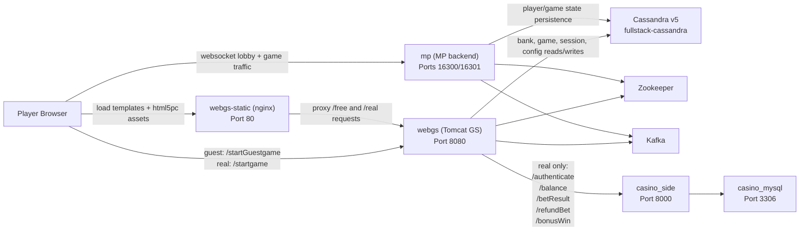

# GSRefactor Final Project Report

Last updated: 2026-03-20 Europe/London

## Executive Summary

This project finished the two main delivery tracks:

1. Move the GS runtime from legacy Cassandra 3.11 to Cassandra 5.0.6.
2. Prove that real legacy data can be migrated into the new Cassandra v5 runtime and that the platform still works in guest mode and real mode afterward.

The final live state proves:

- the refactored GS stack is running on Cassandra v5,
- legacy data was copied into v5 and verified,
- guest mode launches successfully on the clean `/startGuestgame` URL,
- real mode launches successfully on `/startgame`,
- real mode reaches the external casino module for auth and balance activity,
- Docker was regrouped into clearer operational projects.

## Scope That Was Completed

- Cassandra 3.11 -> 5.0.6 migration rehearsal using real legacy rows
- runtime validation after the migration
- guest launch repair and cleanup
- real launch repair and end-to-end verification
- Docker cleanup and regrouping
- safe refactor lane closure documented under readiness PR5

## Step-by-Step Delivery Summary

### Step 1. Cassandra v5 runtime was established

The refactored runtime stack was brought up with:

- `fullstack-cassandra`
- `fullstack-zookeeper`
- `fullstack-kafka`
- `webgs`
- `webgs-static`

Later, MP was integrated into the active runtime through the local override used by the cleaned runtime group:

- `/Users/alexb/Documents/Dev/docker-groups/refactoredgs-microservices/mp.override.yml`

### Step 2. Legacy Cassandra data was migrated and proven

The migration was not treated as a mock-only exercise. A real rehearsal copied legacy Cassandra rows from 3.11 into Cassandra 5.0.6.

Tracked evidence:

- `/Users/alexb/WorkspaceArchive/Dev_20260304/canonical/GSRefactor_canonical_20260307_091032/docs/refactored_release/PR3_CASSANDRA_SCALE_EVIDENCE_SUMMARY.md`

Evidence pack:

- `/Users/alexb/WorkspaceArchive/Dev_20260304/runtime_smoke/archive/migration_rehearsal_20260319_105728`

What was proven:

- non-zero legacy tables were copied into v5,
- empty tables remained empty but preserved,
- migration summary finished with `fails=0` and `mismatches=0`,
- legacy v3 was stopped during runtime verification.

### Step 3. Production-readiness documents were updated

Tracked status file:

- `/Users/alexb/WorkspaceArchive/Dev_20260304/canonical/GSRefactor_canonical_20260307_091032/docs/refactored_release/PRODUCTION_READINESS_STATUS.md`

Current tracked readiness:

- `PRODUCTION_READY=YES`
- `PR3=YES (Evidence)`
- `PR5=YES`

This means the repo-tracked release documentation now treats the Cassandra risk as closed by evidence, not by deferral.

### Step 4. Guest mode was cleaned up

Goal:

- use a clear guest-only URL:
  - `http://127.0.0.1:8080/startGuestgame?bankId=271&gameId=838&lang=en`

Source-level work was committed and pushed in:

- commit `724bd04ff899d8d1d9924f93fb84fe1aef8480b4`
- message: `Guest mode works Casandra v5`

Files changed by that source commit:

- `/Users/alexb/WorkspaceArchive/Dev_20260304/canonical/GSRefactor_canonical_20260307_091032/gs-server/game-server/web-gs/src/main/java/com/dgphoenix/casino/config/ForwardActionServlet.java`
- `/Users/alexb/WorkspaceArchive/Dev_20260304/canonical/GSRefactor_canonical_20260307_091032/gs-server/game-server/web-gs/src/main/webapp/WEB-INF/struts-config.xml`
- `/Users/alexb/WorkspaceArchive/Dev_20260304/canonical/GSRefactor_canonical_20260307_091032/gs-server/game-server/web-gs/src/main/webapp/WEB-INF/web.xml`

What changed:

- `/startGuestgame` was added as a guest alias,
- guest flow auto-infers `subCasinoId` from the bank/subcasino cache when missing,
- guest launch no longer needs the old `cwguestlogin.do` as the primary external URL.

### Step 5. Guest black screen was debugged and fixed

After the guest alias was added, the page still showed a black screen. The alias itself was not the real problem.

The actual blockers were:

- missing Dragonstone `html5pc` assets in the active static mount,
- incorrect websocket URL handling in the rendered template,
- HTML/404 responses being returned where the client expected game JSON/JS.

Runtime/ops fixes applied:

- runtime static content repointed to a working archived `html5pc` bundle,
- `webgs-static` was recreated,
- nginx was updated to normalize websocket URLs for `/free/` and `/real/`.

Relevant runtime config file:

- `/Users/alexb/WorkspaceArchive/Dev_20260304/canonical/GSRefactor_canonical_20260307_091032/gs-server/deploy/refactored_release/nginx/default.conf`

Result:

- guest mode now renders the actual game instead of a black screen.

### Step 6. Real mode was verified and recovered after a regression

Working real launch URL:

- `http://127.0.0.1:8080/startgame?bankId=6275&subCasinoId=507&gameId=838&mode=real&token=<test-token>&lang=en`

Why `subCasinoId=507` is still used locally:

- on `127.0.0.1`, host/domain mapping is not sufficient for automatic subcasino inference in the real-money path,
- so local testing uses explicit `subCasinoId`.

The real-money flow initially worked, then later regressed to:

- `Bank is incorrect`

Root cause:

- during Docker regrouping, the live GS stack came up against a fresh Cassandra instance,
- the previously migrated bank data was not visible in that instance,
- the working runtime data actually lived in a preserved external Docker volume.

Recovery work:

- reattached the refactored runtime to the preserved Cassandra target data volume,
- matched the saved Cassandra cluster name,
- reinserted the MP nickname mapping required for the real session.

Key runtime file:

- `/Users/alexb/Documents/Dev/docker-groups/refactoredgs-microservices/mp.override.yml`

## Fresh Live Proof

The following proofs were refreshed after the recovery and Docker cleanup.

### 1. Docker groups

Current active groups:

- `vault-memory`
- `casino-module`
- `refactoredgs-microservices`

Observed running services:

- `refactoredgs-microservices-fullstack-cassandra-1` healthy
- `refactoredgs-microservices-fullstack-zookeeper-1`
- `refactoredgs-microservices-fullstack-kafka-1`
- `refactoredgs-microservices-webgs-1`
- `refactoredgs-microservices-webgs-static-1`
- `refactoredgs-microservices-mp-1`
- `casino_side`
- `casino_mysql` healthy
- `echovault-memory`

### 2. Health check

- `GET /support/health/check.jsp` -> `200`

### 3. Guest launch proof

- `GET /startGuestgame?bankId=271&gameId=838&lang=en` -> `302`
- redirect target includes inferred `subCasinoId=58`

### 4. Real launch proof

- `GET /startgame?bankId=6275&subCasinoId=507&gameId=838&mode=real&token=<test-token>&lang=en` -> `302`
- redirect target points to `/real/mp/template.jsp?...MODE=real...`

### 5. Cassandra v5 proof

Current Cassandra queries show:

- `rcasinoscks.bankinfocf` count = `4`
- `rcasinoscks.subcasinocf` count = `3`
- `rcasinoscks.gameinfocf` count = `15`
- bank `6275` exists
- subcasino `507` exists
- MP nickname mapping exists:
  - `bav_game_session_001 -> 6275+40962`

### 6. Casino-side proof

Real-mode traffic reached the casino module and returned success.

Observed proof includes:

- `/bav/authenticate ... 200 OK`
- repeated `/bav/balance ... 200 OK` during live real-mode verification
- earlier verification also captured `/bav/betResult ... 200 OK`

This proves that real mode is not only rendering a local template page. It is actually going through the external wallet/auth integration path.

## Current Module Communication Schema

## Docker Cleanup / Regrouping Summary

Final grouping:

### 1. Vault memory

- compose: `vault-memory`
- service: `echovault-memory`

### 2. CM module

- preserved for later use
- intentionally not part of the active launch path

### 3. Casino module

- compose: `casino-module`
- services:
  - `casino_mysql`
  - `casino_side`

### 4. RefactoredGS + microservices

- compose: `refactoredgs-microservices`
- services:
  - `fullstack-cassandra`
  - `fullstack-zookeeper`
  - `fullstack-kafka`
  - `mp`
  - `webgs`
  - `webgs-static`

Legacy/stale migration helpers removed from Docker Desktop:

- `cassandra-legacy`
- `cassandra-target`
- `zookeeper-smoke`
- `kafka-smoke`

## Files Changed In This Final Runtime Round

These are the canonical repo files that reflect the final runtime/operational fixes and are expected to be committed together:

- `/Users/alexb/WorkspaceArchive/Dev_20260304/canonical/GSRefactor_canonical_20260307_091032/gs-server/common/src/main/java/com/dgphoenix/casino/common/cache/data/bank/BankInfo.java`
- `/Users/alexb/WorkspaceArchive/Dev_20260304/canonical/GSRefactor_canonical_20260307_091032/gs-server/deploy/refactored_release/docker-compose.yml`
- `/Users/alexb/WorkspaceArchive/Dev_20260304/canonical/GSRefactor_canonical_20260307_091032/gs-server/deploy/refactored_release/nginx/default.conf`
- `/Users/alexb/WorkspaceArchive/Dev_20260304/canonical/GSRefactor_canonical_20260307_091032/docs/refactored_release/FINAL_PROJECT_REPORT_20260320.md`

Related local runtime support files outside the canonical repo:

- `/Users/alexb/Documents/Dev/docker-groups/vault-memory/docker-compose.yml`
- `/Users/alexb/Documents/Dev/docker-groups/casino-module/docker-compose.yml`
- `/Users/alexb/Documents/Dev/docker-groups/refactoredgs-microservices/mp.override.yml`
- `/Users/alexb/Documents/Dev/docs/11-game-launch-forensics.md`
- `/Users/alexb/Documents/Dev/docs/12-work-diary.md`
- `/Users/alexb/Documents/Dev/docs/13-gsrefactor-final-report.md`

## Final Conclusion

The project reached the intended development-stage finish line:

- Cassandra v5 is the active runtime database,
- migrated legacy data is present and verified,
- guest mode works on the new clean guest URL,
- real mode works on the real-money path,
- casino-side requests are visible during real play,
- the Docker runtime is much cleaner and easier to reason about.

If this needs to be handed to another orchestrator AI, the fastest read-in order is:

1. this file,
2. `PRODUCTION_READINESS_STATUS.md`,
3. `PR3_CASSANDRA_SCALE_EVIDENCE_SUMMARY.md`,
4. the guest launch source files,
5. the nginx and compose runtime fixes,
6. the continuity docs in `/Users/alexb/Documents/Dev/docs/`.
